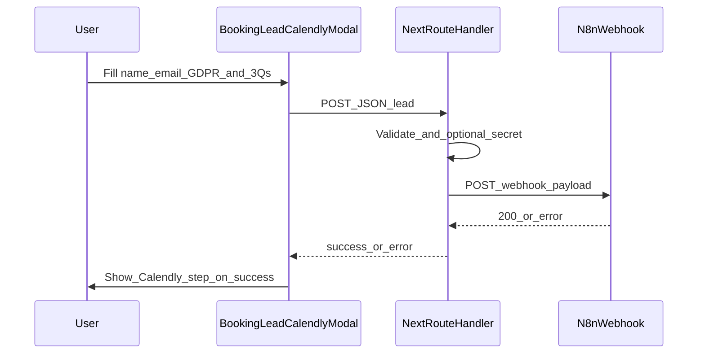

**Status (May 2026):** Archived snapshot. Calendly has been removed from the app; the live spec is [book_website_audit_n8n_webhook_plan.md](book_website_audit_n8n_webhook_plan.md) (`components/booking-lead-modal.tsx`, `lib/leads/`, `/api/leads/*`).

# Book website audit form → n8n webhook (implementation plan)

**Target doc (to add in repo):** [Implementation Plan Folder/book_website_audit_n8n_webhook_plan.md](Implementation%20Plan%20Folder/book_website_audit_n8n_webhook_plan.md)

This plan aligns with the current stack: the scheduling flow lives in [`components/booking-lead-calendly-modal.tsx`](components/booking-lead-calendly-modal.tsx), driven by [`lib/calendly/lead-questions.ts`](lib/calendly/lead-questions.ts) and Calendly prefill in [`lib/calendly/build-prefill-from-lead.ts`](lib/calendly/build-prefill-from-lead.ts). Header/footer CTAs both call the same `onOpenSchedulingModal` today ([`components/header.tsx`](components/header.tsx)).

---

## Current state (short)

- **Book website audit** and **Request demo** open the **same** modal and **same** question sequence (step 0: name/email; steps 1–5: five `LEAD_QUESTION_STEPS`; step 6: Calendly).
- There is **no** public “generic webhook” API route yet; existing [`app/api/...`](app/api) routes are admin/dashboard oriented.
- Calendly-only GDPR banner is already an env concern (`NEXT_PUBLIC_CALENDLY_HIDE_GDPR_BANNER` in [`.example`](.env.local.example)); **on-site** GDPR consent is separate and should be explicit for your n8n payload.

---

## Goals

1. For **Book website audit**, collect: **full name**, **email**, **three business questions**, **GDPR consent checkbox** (required to proceed).
2. After the lead data is valid, **POST a JSON payload to n8n** via a **Webhook** trigger (workflow URL from env).
3. Keep **Calendly** as the scheduling step **after** qualification (unless product later drops it), with prefill behaviour preserved or intentionally simplified for the shorter questionnaire.

---

## Recommendations (architecture)

| Topic | Recommendation |
|--------|----------------|
| **Webhook exposure** | **Never** call the n8n production URL from the browser. Add a **Next.js Route Handler** (e.g. `app/api/leads/website-audit/route.ts`) that validates input, then `fetch()` the n8n webhook **server-side** using a **secret** env var. Optionally require a static header (n8n “Header Auth” or custom `X-Webhook-Secret`) so random traffic cannot spam the workflow. |
| **Request demo vs audit** | Today both buttons share one modal. **Pass a `intent` prop** (`'website_audit' \| 'demo'`) from [`components/landing-home-client.tsx`](components/landing-home-client.tsx) / [`components/footer.tsx`](components/footer.tsx) / [`components/book-call-section.tsx`](components/book-call-section.tsx) so the modal can show **3 questions for audit** and optionally **keep 5 for demo** (or a different set later). Include `intent` in the n8n payload. |
| **Question set** | Replace or branch `LEAD_QUESTION_STEPS`: for audit, define **exactly three** steps (new copy aligned to “website audit”: e.g. primary goal, current site / URL, timeline—or your chosen trio). Keep types in [`LeadFormState`](lib/calendly/lead-questions.ts) coherent; remove unused fields for the audit path or use a **narrower type** + mapper to Calendly prefill. |
| **GDPR** | Add checkbox + link to **Privacy policy** (and record **consent: true**, **policy version or URL**, **timestamp** in payload). This is **not** a substitute for legal review; pair with your privacy notice and retention policy in n8n/CRM. Do **not** assume Calendly’s banner replaces this if you are processing lead data **before** Calendly. |
| **When to fire the webhook** | **After** all pre-Calendly steps validate, **immediately before** advancing to the Calendly step (or on “Continue” from the last business question). That way you capture leads even if they abandon Calendly. Optionally **also** trigger n8n on Calendly booking completion later (requires Calendly webhooks / tier—out of scope unless you upgrade). |
| **Failure handling** | If n8n is down: **block** progression with a clear error + retry, **or** allow Calendly but **queue** server-side (more work). For v1, **block + retry** is simpler and avoids silent data loss. |
| **Abuse** | Add basic **rate limiting** (per IP) on the Route Handler, max body size, and honeypot field if spam appears. |
| **PII in logs** | Do not log full email/name in Vercel logs; log correlation id only. |

---

## Data flow (target)



---

## Step-by-step implementation (engineering)

1. **Product copy & schema**
   - Finalize the **three** audit questions (headlines, options vs free text).
   - Decide **demo** behaviour: same 3 questions, old 5, or separate modal (recommend **`intent` prop** + shared shell).

2. **Extend modal state**
   - Add `gdprAccepted: boolean` (or `marketingConsent` if legally distinct—confirm with counsel).
   - Step 0 validation: require name, email, **and** GDPR checked ([`validateCurrent`](components/booking-lead-calendly-modal.tsx) for `step === 0`).
   - Recalculate `CALENDLY_STEP` / `TOTAL_STEPS` after changing `LEAD_QUESTION_STEPS` length (currently derived from `LEAD_QUESTION_STEPS.length`; hard-coded `5` / `6` in `goNext` must become **dynamic** to avoid bugs).

3. **API route**
   - `POST /api/leads/website-audit` (or generic `/api/leads` with `type` field).
   - Zod (or similar) schema: name, email, three answers, `gdprAccepted: literal(true)`, optional `intent`, optional UTM fields from query string if you pass them into the modal later.
   - Server env: `N8N_WEBHOOK_URL` (or `WEBSITE_AUDIT_N8N_WEBHOOK_URL`), optional `N8N_WEBHOOK_SECRET` for header.
   - `fetch(webhook, { method: 'POST', headers, body: JSON.stringify(...) })` with timeout; map errors to 502/503 for client.

4. **Client call from modal**
   - On transition from **last business step** to Calendly: `await fetch('/api/...')` then set prefill + increment Calendly nonce (today this happens in [`goNext`](components/booking-lead-calendly-modal.tsx) when `step === 5`—will move to “last pre-calendly step”).
   - Loading state on **Continue**; disable double-submit.

5. **Calendly prefill**
   - Update [`buildCalendlyPrefillFromLead`](lib/calendly/build-prefill-from-lead.ts) / [`LEAD_QUESTION_STEPS`](lib/calendly/lead-questions.ts) so the human-readable summary still matches **3** answers if you use `NEXT_PUBLIC_CALENDLY_SUMMARY_CUSTOM_QUESTION_ID`.

6. **Environment & docs**
   - Add vars to [`.env.local.example`](.env.local.example) (server-only secrets **without** `NEXT_PUBLIC_`).
   - Document expected **JSON shape** for n8n (see below).

7. **QA**
   - Happy path: webhook receives payload → modal shows Calendly.
   - Validation: missing GDPR → cannot continue.
   - n8n returns 500 → user sees error; no duplicate sends if they retry once (idempotency optional).

---

## n8n workflow (ops) checklist

1. New workflow: **Webhook** trigger (POST), path or authentication per n8n docs.
2. **Test URL** vs **Production URL**; store production URL in Vercel env.
3. First nodes: **Validate** required fields (optional **IF** node), then branch to **Email** (SMTP/SendGrid), **Google Sheets**, **CRM**, etc.
4. Error notifications: **Error Trigger** workflow or n8n execution log alerts.
5. **GDPR**: document retention in the sheet/CRM; avoid copying full payloads into unsecured channels.

**Example payload shape (illustrative):**

```json
{
  "source": "1dental_niche_outreach",
  "intent": "website_audit",
  "fullName": "…",
  "email": "…",
  "business": { "q1": "…", "q2": "…", "q3": "…" },
  "consent": {
    "gdpr": true,
    "privacyPolicyUrl": "https://…",
    "submittedAt": "2026-05-06T12:00:00.000Z"
  }
}
```

---

## Suggestions beyond v1

- **Double opt-in** for marketing email (if n8n sends campaigns)—separate from “contact me about an audit”.
- **Server-side duplicate detection** (same email within N minutes) to reduce noise.
- **Calendly invitee UUID** in payload after booking if you add Calendly webhooks later for a single “golden record” in n8n.

---

## Deliverable in repo

After you approve this plan in the agent workflow, the markdown file should be **added verbatim** (or with minor edits) as:

`Implementation Plan Folder/book_website_audit_n8n_webhook_plan.md`

so it sits alongside [CALENDLY_INTEGRATION_PLAN.md](Implementation%20Plan%20Folder/CALENDLY_INTEGRATION_PLAN.md) and other implementation notes.
