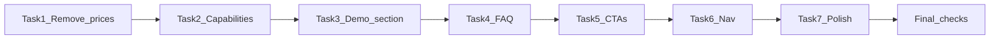

# Copy Improvements — Implementation Plan

> Follow-up after user testing of the Carter Dental demo landing (`/`). Focus: remove paid-audit pricing, centre copy on **the prospect’s dental clinic website**, and show what Standout Group can implement — not sell audit tiers or tell a founder story.
>
> **Status:** Implemented (May 2026).
>
> ## Rules of engagement while executing this plan
>
> 1. Work tasks **strictly in order** (Task 1 → Task 7).
> 2. Do **not** start the next task until **every** checkbox under the current task is ticked `[x]`.
> 3. After completing a task, tick its parent line in the **Task Status Summary** at the bottom.
> 4. One task at a time — no parallel task work across files unless a sub-checkbox explicitly says otherwise.
> 5. Copy changes only on this pass unless a task notes a structural rename (e.g. section `id`, component file rename).
> 6. The free audit is requested via [components/booking-lead-modal.tsx](../components/booking-lead-modal.tsx) — treat that modal as the source of truth for “free” language.

---

## Brand model (confirmed)

- **Carter Dental Studio** = live demo site prospects browse (proof of craft and how their site can look after working with Standout Group).
- **Standout Group** = agency behind it (emails, audit delivery, rebuilds).
- **No founder story** on the landing — remove/replace [components/amelia-note.tsx](../components/amelia-note.tsx). The page should answer: *“What could my clinic’s website do?”* not *“Who started this practice?”*

### Standout Group — copy guideline (purpose)

Traditional dental websites are a brochure. Standout Group builds a site that works like a **24/7 employee** that qualifies leads and books appointments.

| Pain (for practice owners) | 90-day cost if ignored | What we implement on *their* site |
| -------------------------- | ---------------------- | --------------------------------- |
| Low conversion on paid traffic | Compounded lost revenue; competitors capture share | Conversion-focused layout, clear CTAs, funnel structure |
| Site is a brochure, not a lead system | Sales time wasted; high-intent leads go cold | Structured intake, obvious booking path, fast follow-up hooks |
| Poor mobile UX (60–80% of traffic) | Half the mobile conversion rate; weaker SEO | Mobile-first layout, fast loads, tap-friendly booking |
| Outdated brand vs competitors | Perceived as smaller / less credible; longer sales cycles | Modern trust signals — team, reviews, credentials |

**Outcomes to echo in copy (when honest / not fabricated):** more booked calls per 100 visitors, less time on unqualified leads, more total leads from mobile, shorter enquiry-to-contract cycle — always tied to *your clinic’s website*.

Use this table when writing headlines, cards, FAQ answers, and the demo/outcomes section — not as literal stats on the page unless you have verified client numbers.

---

## Goals

1. **Free initial audit only** — not a paid product; first audit via the lead form (“Get your free website audit”).
2. **Clinic-centric voice** — *your clinic / your site / your patients*; not patient-chair FAQ copy.
3. **Outcome + feature led** — conversion, trust, booking flow, mobile UX as things we **build on their site**; Carter demo as evidence.

---

## Current-state audit

| Area | File | Issue |
| ---- | ---- | ----- |
| Audit pricing | [components/what-you-get.tsx](../components/what-you-get.tsx) | `From £149` / `£199` / `£249`; `id="pricing"`; “Three focused audits” reads like paid SKUs |
| Pricing in demo SVG | [components/proof-slider.tsx](../components/proof-slider.tsx) | After mockup embeds same `From £…` in inline SVG (~lines 312–364) |
| Patient FAQ | [components/faq-section.tsx](../components/faq-section.tsx) | Nervous-patient / appointment / treatment pricing — wrong audience |
| Founder narrative | [components/amelia-note.tsx](../components/amelia-note.tsx) | “Why I started Carter Dental” — contradicts demo-only positioning |
| Nav mismatch | [components/header.tsx](../components/header.tsx) | “Pricing” → `#pricing`; “Treatments” → `#treatments` (missing on landing) |
| CTA inconsistency | Hero, footer, concern picker, etc. | “Book Website Audit” vs modal “Get my free audit” |
| Modal (good) | [components/booking-lead-modal.tsx](../components/booking-lead-modal.tsx) | Already free-audit framed — keep |

**Already strong (keep / build on):** Hero (“Your dental site is costing you patients”), concern picker, proof slider + testimonials, Quick Find → audit form.

---

## Recommended messaging pillars

1. **Your clinic, your site** — we improve *your* dental clinic website so more visitors become booked patients.
2. **Living proof** — you’re browsing an example of what we build; imagine this for your practice.
3. **Free first step** — request a free website audit via the form; we review *your* URL and email recommendations within 2 business days.
4. **What we implement** — booking clarity, mobile UX, speed, trust signals, lead capture — not “buy audit tier 2.”

---

## Task 1 — Remove all audit pricing

**Touches:** [components/what-you-get.tsx](../components/what-you-get.tsx), [components/proof-slider.tsx](../components/proof-slider.tsx)

**Goal:** No pound amounts or “From £…” anywhere for website audits on the live landing or before/after mockup.

- [x] In `what-you-get.tsx`, remove the `price` field from each entry in `CARDS`.
- [x] In `what-you-get.tsx`, remove the `
` that renders `{price}` under each card.
- [x] In `proof-slider.tsx` `AfterMockup` SVG, delete the `From £149` text node on the Speed card.
- [x] In `proof-slider.tsx` `AfterMockup` SVG, delete the `From £199` text node on the Lead-flow card.
- [x] In `proof-slider.tsx` `AfterMockup` SVG, delete the `From £249` text node on the Mobile UX card.
- [x] Grep the repo for `£149`, `£199`, `£249`, and `From £` on landing-related files — confirm zero hits on `/` render path.
- [x] **Do not** change [components/pricing-section.tsx](../components/pricing-section.tsx) on this pass (unused on `/`; optional cleanup later).
- [x] Visual check: after mockup cards still read as feature labels, not empty price slots.

**Task 1 acceptance:** No `£` tied to audits on landing or proof SVG.

---

## Task 2 — Reframe “What you get” → clinic capabilities

**Touches:** [components/what-you-get.tsx](../components/what-you-get.tsx), [components/header.tsx](../components/header.tsx) (nav label only — full anchor fix in Task 6)

**Goal:** Section sells **what we build on their clinic site**, not paid audit tiers.

### 2a — Structure

- [x] Change section `id` from `pricing` to `capabilities` (or `what-we-build` — pick one and use consistently).
- [x] Update `aria-labelledby` / heading `id` if renamed for consistency.

### 2b — Section copy

- [x] Eyebrow: change “What you get” → **“What we build for your clinic”** (or approved variant).
- [x] H2: change “Three focused audits. One clear next step.” → **“Features that turn visitors into booked patients”** (or approved variant).
- [x] Subtitle: replace “We zero in on the one thing…” with copy that names **upgrades on private practice websites** (see messaging pillars).
- [x] Add optional micro-line under grid: **“Your first website audit is free — tell us your URL in the form.”**

### 2c — Card copy (rename + rewrite benefits)

- [x] Card 1: rename “Speed audit” → **“Faster mobile experience”**; benefit about load speed / fewer bounces before booking.
- [x] Card 2: rename “Lead-flow audit” → **“Clear booking path”**; benefit about one obvious route to enquiry or online booking.
- [x] Card 3: rename “Mobile UX audit” → **“Trust at first glance”**; benefit about credentials, reviews, team where new patients expect them.
- [x] Ensure all three card bodies use **your / your clinic / your site** where natural.

### 2d — Proof slider SVG labels (align with cards)

- [x] In `AfterMockup`, update card titles in SVG to match new names (no prices).
- [x] Update one-line benefit text in SVG to match card copy (or shortened equivalents).

**Task 2 acceptance:** Section reads as capabilities for *their* clinic; no “audit” product names as SKUs.

---

## Task 3 — Replace Amelia founder note with demo / outcomes section

**Touches:** [components/amelia-note.tsx](../components/amelia-note.tsx) → replace or rename (e.g. `demo-outcomes.tsx`), [components/landing-home-client.tsx](../components/landing-home-client.tsx)

**Goal:** No founder story; viewer understands this page is a **living example** of what Standout Group delivers.

### 3a — Remove

- [x] Remove “Why I started Carter Dental” heading and all founder narrative paragraphs.
- [x] Remove “— Dr Amelia Carter” sign-off and founder-story framing.
- [x] Remove or replace founder portrait (`/amelia.jpg`) — no personal founder narrative.

### 3b — Add (new section content)

- [x] Eyebrow: e.g. **“You’re viewing a demo”**.
- [x] H2: e.g. **“This is what your clinic’s website could do”**.
- [x] Body (2–3 sentences): Carter Dental Studio = working example; Standout Group builds the same for UK private practices with *their* brand, team, treatments.
- [x] Optional: 3 outcome/feature chips (honest, non-fabricated): e.g. clear CTA above fold, mobile-first layout, social proof block.
- [x] Image strategy decided: device mock / homepage crop / no image — document choice in PR.

### 3c — Wire up

- [x] Update import and render in `landing-home-client.tsx` (rename component if file renamed).
- [x] Remove dead `amelia-note` export if file deleted (or leave file unused only if intentionally deferred — prefer rename/replace in same task).

**Task 3 acceptance:** No founder story; section explains demo + possibilities for *their* clinic.

---

## Task 4 — Rewrite FAQ for practice owners

**Touches:** [components/faq-section.tsx](../components/faq-section.tsx)

**Goal:** FAQ speaks to practice owners considering a website rebuild / free audit — not patients booking a check-up.

### 4a — Section header + intro

- [x] H2: change “Everything you need to know before booking” → owner-focused title (e.g. **“Questions practice owners ask before a rebuild”**).
- [x] Intro paragraph: rewrite for **practice owners**, not patients choosing a dentist.
- [x] Remove or rewrite italic quote block if it still sounds patient-facing.

### 4b — FAQ accordion (target 6–8 items)

- [x] Replace all 12 patient FAQs with owner questions; suggested topics:
  - [x] What happens after I request the free audit?
  - [x] Do you work with our existing branding and content?
  - [x] How long does a typical clinic website rebuild take?
  - [x] Will this work with our booking system (Denplan / SOE / etc.)?
  - [x] What if we only need fixes, not a full rebuild?
  - [x] Who hosts the site after launch?
  - [x] Is the audit really free — is there a hard sales call?
  - [x] What does Standout Group do vs what I’m seeing on this demo page?
- [x] Each answer uses **your clinic / your site** and ties to Standout Group outcomes where relevant.

### 4c — Reassurance cards (sidebar)

- [x] Rewrite three cards for owners (e.g. no pressure, transparent process, built for private practices) — not “nervous patients”.

### 4d — “Common concerns” grid

- [x] H3: change “What stops most patients from booking” → **practices fixing their site** (e.g. no time, unclear ROI, outdated mobile, afraid of disruption).
- [x] Rewrite all five concern/response pairs for practice owners.

**Task 4 acceptance:** No patient appointment / nervous-patient FAQ remains on landing.

---

## Task 5 — Align CTAs and free-audit messaging

**Touches:** [components/hero.tsx](../components/hero.tsx), [components/footer.tsx](../components/footer.tsx), [components/concern-picker.tsx](../components/concern-picker.tsx), [components/proof-slider.tsx](../components/proof-slider.tsx), [components/what-you-get.tsx](../components/what-you-get.tsx), [components/mobile-sticky-cta.tsx](../components/mobile-sticky-cta.tsx), [components/header.tsx](../components/header.tsx) (sheet CTA), [emails/audit-request-received.html](../emails/audit-request-received.html)

**Goal:** “Free” is obvious before the form opens; labels align with modal.

### 5a — Primary CTAs

- [x] Decide primary label: **`Get my free website audit`** (recommended) vs keep **`Book Website Audit`** — document decision.
- [x] Hero CTA: apply chosen primary label.
- [x] Mobile sticky CTA: match hero primary label.

### 5b — Secondary CTAs (mid-page)

- [x] Concern picker, proof slider, what-you-get: use secondary label (e.g. **“Request your free audit”**) OR primary — but at least one mid-page mention of **“free”** in section copy (Task 2 micro-line counts).

### 5c — Footer

- [x] Extend footer subline to state free audit of **your** clinic website + 2 business day email turnaround + no charge for initial review.

### 5d — Modal + email (verify only)

- [x] Confirm modal title/description still say free audit (no code change expected).
- [x] Grep `audit-request-received.html` for paid tier / £ — remove or flag if found.

**Task 5 acceptance:** “Free” visible in modal + footer or capabilities section + at least one primary CTA.

---

## Task 6 — Fix navigation anchors

**Touches:** [components/header.tsx](../components/header.tsx)

**Goal:** Every nav link scrolls to a real section on `/`.

- [x] Remove **Treatments** from `moreLinks` OR repoint to a real section (none on landing today — **remove** recommended).
- [x] Rename **Pricing** → **What we build** (or **Capabilities**) pointing to `#capabilities` (must match Task 2 `id`).
- [x] Keep **Reviews** → `#proof`.
- [x] Test desktop dropdown and mobile sheet links after Task 2 `id` is live.

**Task 6 acceptance:** No dead `#treatments` or `#pricing` links in header.

---

## Task 7 — Light copy pass on remaining sections

**Touches:** [components/hero.tsx](../components/hero.tsx), [components/concern-picker.tsx](../components/concern-picker.tsx), [components/proof-slider.tsx](../components/proof-slider.tsx), [components/landing-quick-find.tsx](../components/landing-quick-find.tsx), [app/layout.tsx](../app/layout.tsx) (metadata)

**Goal:** Residual sections consistently say **your clinic’s website**.

- [x] Hero subline: optionally mention free audit of **your** site.
- [x] Concern picker: add “on **your** site” in heading or subtitle where natural.
- [x] Proof slider H2/sub: “your clinic” / “a practice like yours”.
- [x] Quick Find H2: e.g. “Tell us what’s holding **your** clinic site back”.
- [x] `layout.tsx` meta title + description: clinic website conversion, not dental appointments.
- [x] Full-page read-through: every H2 applies to **their dental clinic website**, not chair-side treatment sales.

**Task 7 acceptance:** Metadata + remaining sections pass clinic-owner read-through.

---

## Final checks before declaring “done”

Run only after Tasks 1–7 are all ticked in Task Status Summary.

- [x] Grep landing render path: no audit `£` prices.
- [x] No patient-facing FAQ on `/`.
- [x] No founder / Amelia story on `/`.
- [x] Header nav: all hashes resolve.
- [x] Free audit mentioned in modal + footer or capabilities + primary CTA.
- [x] `pnpm build` clean (when implementing).
- [x] Manual mobile + desktop scroll: copy reads as “your clinic’s website” throughout.

---

## Suggestions (product / copy strategy — optional follow-ups)

1. **Demo disclaimer strip** under header: “Demo for a fictional practice — your audit reviews *your* real URL.”
2. **Personalization in confirmation email:** “We’ll review *[practiceName]*’s site” (n8n template).
3. **Retire audit product language:** no “tier”, “package”, “Speed audit” as product names.
4. **Testimonials:** optionally attribute rebuild to Standout Group so demo → agency is obvious.
5. **Concern picker → modal:** pass selected concern into audit form context (like Quick Find bottleneck).
6. **Concern picker labels:** align three concerns with Standout pain table (conversion, lead system, mobile).

---

## Out of scope (this plan)

- [components/pricing-section.tsx](../components/pricing-section.tsx) (patient treatment prices — not on `/`).
- Dashboard / admin / booking app copy.
- Standout violet rebrand on Carter demo page.
- n8n / API changes unless FAQ drives new form fields.

---

## Suggested implementation order

| Task | Estimate |
| ---- | -------- |
| 1 — Remove pricing | ~30 min |
| 2 — Capabilities section | ~1–2 h |
| 3 — Demo/outcomes section | ~1–2 h |
| 4 — FAQ rewrite | ~2–3 h |
| 5 — CTAs + footer | ~1 h |
| 6 — Nav anchors | ~15 min |
| 7 — Polish + metadata | ~1 h |

**Total:** ~1 working day including stakeholder copy review.

---

## Task Status Summary

Mirror progress here — tick the parent **only** when every sub-checkbox under that task above is `[x]`.

- [x] Task 1 — Remove all audit pricing
- [x] Task 2 — Reframe “What you get” → clinic capabilities
- [x] Task 3 — Replace Amelia founder note with demo / outcomes section
- [x] Task 4 — Rewrite FAQ for practice owners
- [x] Task 5 — Align CTAs and free-audit messaging
- [x] Task 6 — Fix navigation anchors
- [x] Task 7 — Light copy pass on remaining sections
- [x] Final checks
