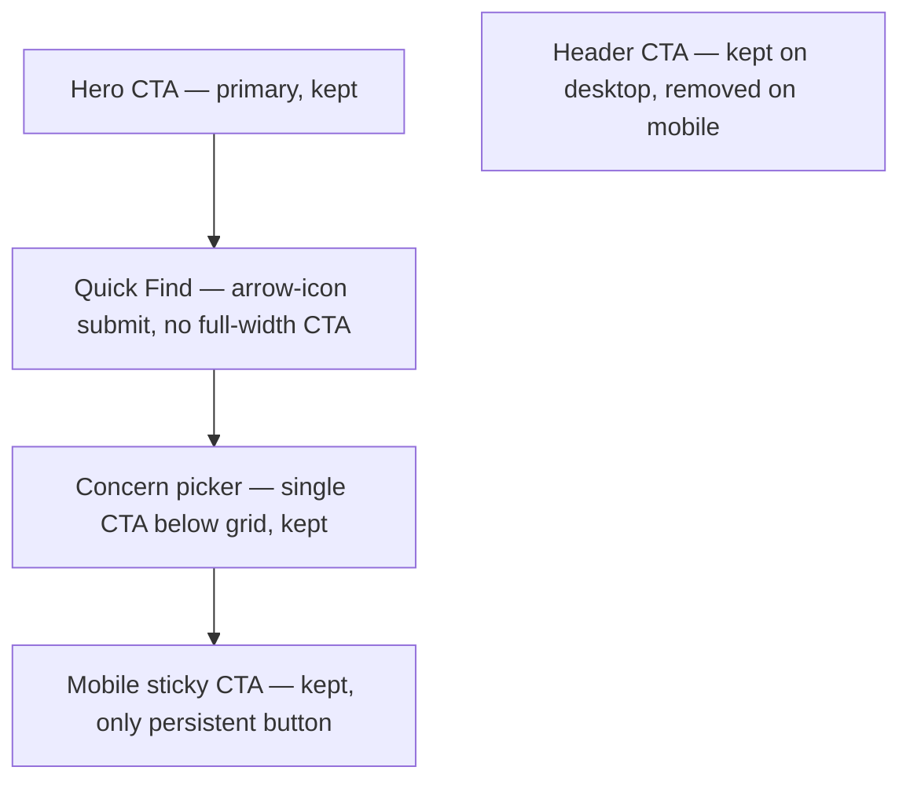

# Final Website Copy Adjustments — Implementation Plan

> Follow-up tweaks after a round of user testing of the Carter Dental demo site
> (the outreach landing that prospects see at `/`). All changes are copy-,
> layout- and accessibility-focused; no new pages or backend endpoints.
>
> Rules of engagement while executing this plan:
>
> 1. Work tasks **strictly in order** (top → bottom).
> 2. Do **not** start a new task until every checkbox under the current task is ticked.
> 3. After completing each task, tick its parent checkbox in the **Task Status Summary** section at the bottom.
> 4. The single primary CTA label remains **`Book Website Audit`** wherever it appears.
> 5. All motion respects `prefersReducedMotion()` in `lib/prefers-reduced-motion.ts`.
> 6. All glass surfaces respect `@media (prefers-reduced-transparency)`.

---

## Why these tweaks

On a 390 × 844 mobile viewport the current landing page surfaces **four** `Book Website Audit` buttons in the first scroll position (header, hero, Quick Find form, sticky bottom bar), which testers described as "pushy". The Quick Find search bar reads as a placeholder; the concern picker copy frames the problem as a guilt-trip ("What's costing your practice patients right now?") rather than a diagnostic. The before/after slider is unusable on touch. And the footer has no social handles, so the brand looks thin.

The five tasks below address those findings in order of user-visible impact.

---

## Mobile CTA inventory (target state)

On mobile, only the **Hero** and the **Mobile Sticky** present a full `Book Website Audit` button at a time. The Quick Find form keeps a small arrow-icon submit (still tappable, no "Book Website Audit" wording on mobile). The Concern Picker's section-level CTA stays because it only appears after scroll. The Header CTA on mobile is removed because the sticky bottom bar covers the same need without crowding the hero.

---

## Task 1 — Trim duplicate `Book Website Audit` buttons on mobile

Touches: [components/header.tsx](components/header.tsx), [components/landing-quick-find.tsx](components/landing-quick-find.tsx).

Goal: cut the top-of-page button count on mobile from **4 → 2** without losing any conversion path.

- [x] In [components/header.tsx](components/header.tsx), remove the `MagneticCTAButton` rendered inside the mobile toolbar (`
…
`). Keep the `HeaderAuthSection` and the hamburger button.
- [x] In the same mobile toolbar, increase the hamburger's tap target to remain ≥ 44 × 44 px and tighten the gap (the toolbar should not look empty after the CTA is gone).
- [x] Leave the desktop CTA (`hidden md:flex` branch) untouched — it stays as the only top-level CTA on tablet/desktop.
- [x] Leave the in-sheet CTA inside the mobile glass nav sheet (`Book Website Audit` rendered when the hamburger opens) untouched — it is intentional inside an opened menu.
- [x] In [components/landing-quick-find.tsx](components/landing-quick-find.tsx), delete the mobile-only `
…
` block (the full-width `Book Website Audit` shown below the input on mobile).
- [x] Replace the desktop-only absolute `MagneticCTAButton` ("Book Website Audit" + arrow) with a compact arrow-icon submit that renders on **all viewports**:
  - 44 × 44 px round button positioned `absolute right-2` inside the input bar.
  - Uses the `ArrowRight` icon from `lucide-react` already imported.
  - `aria-label="Get my free audit"` so screen readers still know what submits.
  - Styling: `cta` variant pill, no text label.
- [x] Adjust input right-padding so text never collides with the new icon button: `pr-16` on mobile, `pr-20` on desktop (whatever lines up visually with the smaller button).
- [x] Verify that pressing Enter inside the input still submits the form (it should, because the icon button is `type="submit"`).
- [x] Manually verify on a 390 × 844 viewport that only **Hero** + **Mobile Sticky** show "Book Website Audit" text on first paint; the Quick Find icon button and concern picker CTA appear only after scrolling.

---

## Task 2 — Rewrite the Quick Find bar as a bottleneck capture

Touches: [components/landing-quick-find.tsx](components/landing-quick-find.tsx), [components/booking-lead-modal.tsx](components/booking-lead-modal.tsx), [components/landing-home-client.tsx](components/landing-home-client.tsx).

Goal: turn the Quick Find from a placeholder-looking search bar into an inviting "describe your bottleneck → we open the audit form pre-filled" experience.

### 2a — Copy changes (Quick Find component)

- [x] In [components/landing-quick-find.tsx](components/landing-quick-find.tsx), change the `<h2>` text from `Not sure where to start? Try this →` to `Let us help you get started`.
- [x] Update the heading's accent so the "→" arrow span is removed (the heading is now a friendly statement, not a prompt).
- [x] Change the input `placeholder` from `Tell me what you'd like to fix…` to `e.g. sales team waste time chasing`.
- [x] Change the `<label htmlFor="quick-find-input">` sr-only text from `Tell me what you'd like to fix` to `Describe your biggest website bottleneck`.
- [x] Delete the `SUGGESTIONS` constant (`Slow on mobile`, `Low bookings`, `Bad on Google`) and the entire `<ul>` block that renders the suggestion chips below the form.
- [x] Remove the `Button` import from `@/components/ui/button` if no longer used after the chip removal and Task 1's button changes.

### 2b — Pass the bottleneck text into the audit modal

- [x] In [components/landing-quick-find.tsx](components/landing-quick-find.tsx), change `handleSubmit` so it calls a new `onOpenSchedulingModal('website_audit', { bottleneck: value.trim() })` signature, only sending the second argument when the user typed something.
- [x] In [components/landing-home-client.tsx](components/landing-home-client.tsx), widen the `openSchedulingModal` callback to accept an optional `{ bottleneck?: string }` context object, store it in a new `schedulingContext` state, and pass it to `<BookingLeadModal …context={schedulingContext} />`.
- [x] Update the `LandingBookClickHandler` / `LeadSchedulingIntent` typings in [lib/landing/book-cta.ts](lib/landing/book-cta.ts) (or wherever the callback type lives) so callers that don't pass context continue to compile.
- [x] In [components/booking-lead-modal.tsx](components/booking-lead-modal.tsx):
  - [x] Add an optional `context?: { bottleneck?: string }` prop.
  - [x] Extend the form schema with `bottleneck: z.string().trim().max(500).optional()`.
  - [x] Render a new `<Label htmlFor="audit-bottleneck">Your biggest bottleneck (optional)</Label>` + `<textarea>` (or single-line `<Input>`) immediately above the Website URL field. Pre-fill with `context?.bottleneck` via `reset({ ...emptyValues, bottleneck: context?.bottleneck ?? '' })` when the modal opens with new context.
  - [x] Include the `bottleneck` value in the JSON body sent to `/api/leads/website-audit`.
- [x] In [app/api/leads/website-audit/route.ts](app/api/leads/website-audit/route.ts):
  - [x] Extend `bodySchema` with `bottleneck: z.string().trim().max(500).optional()`.
  - [x] Forward `bottleneck` in the n8n webhook payload (alongside `websiteUrl`, `practiceName`).
  - [x] Keep the schema `.strict()` so unknown fields still error.

### 2c — Analytics

- [x] In `trackEvent('quick_find_intent_selected', …)`, switch the payload to `{ bottleneck: value.trim() }` (replacing the now-removed `concernId` / `concernLabel`). Truncate the value to 200 chars before tracking.
- [x] In [components/booking-lead-modal.tsx](components/booking-lead-modal.tsx), include `bottleneckProvided: Boolean(context?.bottleneck)` in the `audit_modal_opened` analytics call so we can measure how often Quick Find drives the modal.

---

## Task 3 — Reframe the Concern Picker as a diagnostic checklist

Touches: [components/concern-picker.tsx](components/concern-picker.tsx).

Goal: stop framing the visitor as the problem ("what's costing **your practice** patients?") and reframe as a relatable diagnostic ("this is what we usually see…").

- [x] Change the eyebrow tag from `Sound familiar?` to `Common diagnostics` (keeps the same pill styling, replaces the slightly accusatory tone).
- [x] Change the `<h2 id="concern-picker-heading">` from `What's costing your practice patients right now?` to `Common website bottlenecks costing patients`.
- [x] Replace the subtitle paragraph (`Pick the one that hurts the most — we'll line up an audit that fixes it first.`) with: `This is what we usually see hurting other practices' sites — sound familiar?`
- [x] Replace the `CONCERNS` constant entries (keep the same array name; only the contents change) with exactly three items, in this order:
  1. `{ id: 'booking-link', label: 'Booking link ineffective' }`
  2. `{ id: 'no-conversion', label: 'Team wastes time chasing leads that never convert' }`
  3. `{ id: 'dated-mobile', label: 'Site looks dated on mobile' }`
- [x] Remove the fourth concern (`unknown-issues` → "You don't know what's broken").
- [x] Update the grid layout: with three items, switch `sm:grid-cols-2` to `sm:grid-cols-3` so each concern reads as a balanced column on tablet/desktop. On mobile they remain single-column.
- [x] Reuse the existing `trackEvent('concern_selected', …)` call; the payload keys stay the same but reflect the new labels.
- [x] Confirm each concern button is still ≥ 44 × 44 px and keyboard focusable.
- [x] The single section CTA (`Book Website Audit`) below the grid stays untouched.

---

## Task 4 — Fix the Before/After slider on mobile

Touches: [components/proof-slider.tsx](components/proof-slider.tsx).

Goal: the compare slider currently does not respond to touch drag on iOS/Android because (a) the handle's hit area is only 1 px wide, and (b) the wrapper inherits the page's vertical pan, so horizontal swipes are absorbed by scroll.

- [x] Wrap the `<ReactCompareSlider />` in (or apply directly to it) `style={{ touchAction: 'none' }}` so horizontal drags are not stolen by the document's `pan-y` scroll. The outer card already has `overflow-hidden`, so this is safe.
- [x] Set the `<ReactCompareSlider />` `boundsPadding="16px"` (typed as a CSS string) so the handle can never sit fully off-screen on narrow viewports.
- [x] Explicitly set `onlyHandleDraggable={false}` (it's the library default, but keep it pinned so future upgrades don't silently change it).
- [x] Rebuild the `handle` slot so the **tappable area** is 44 × 100 % (instead of 1 × 100 %):
  - Outer container: `flex h-full w-11 items-center justify-center cursor-ew-resize touch-none`.
  - Inner pill: keep the existing 1 px white bar + the round `ArrowLeftRight` button on top, but render them centred inside the wider transparent hit area.
  - Add `role="slider"`, `aria-label="Drag to compare before and after"`, `tabIndex={0}` so keyboard users can focus and arrow-key through (`react-compare-slider` ships keyboard support; verify it works once the role is set).
- [x] Add a thin instructional caption under the slider on mobile only (`md:hidden`): `Drag the handle ←→ to compare` so first-time touch users know to interact.
- [x] Smoke test on:
  - iOS Safari (real device or DevTools iPhone 15 simulation): horizontal drag of the handle changes the split; vertical drag of the **page** (outside the slider) still scrolls; pinch-zoom is not disabled.
  - Android Chrome equivalent.
  - Desktop pointer drag still works.
  - Keyboard: focus the handle, press Left/Right arrow → split moves; Home/End → 0 / 100.

---

## Task 5 — Add social media placeholder links to the footer

Touches: [components/footer.tsx](components/footer.tsx).

Goal: give the footer some social proof anchors. Links point at `#` for now (placeholders, no live destinations needed).

- [x] Add a `socialLinks` array near the existing `legalLinks` constant:
  - `{ label: 'Instagram', href: '#', Icon: Instagram }`
  - `{ label: 'Facebook',  href: '#', Icon: Facebook  }`
  - `{ label: 'LinkedIn',  href: '#', Icon: Linkedin  }`
  - `{ label: 'YouTube',   href: '#', Icon: Youtube   }`
- [x] Import the icons from `lucide-react`: `Instagram, Facebook, Linkedin, Youtube`.
- [x] Render a new `<ul>` row between the existing CTA button and the legal/copyright row. Layout: horizontal row, centred, `gap-3`. Each item is a `<Link>` (Next.js) with:
  - `href={link.href}` and `target="_blank"`, `rel="noopener noreferrer"`.
  - `aria-label={\`\${link.label} (opens in new tab)\`}` so screen readers announce destination.
  - Inner: `<link.Icon className="h-5 w-5" aria-hidden="true" />`.
  - Tap target: `inline-flex h-11 w-11 items-center justify-center rounded-full border border-[var(--glass-border)] bg-background/80 text-foreground/80 transition-colors hover:text-foreground hover:border-primary/40 focus-visible:outline-none focus-visible:ring-2 focus-visible:ring-ring focus-visible:ring-offset-2 focus-visible:ring-offset-background`.
- [x] The order rendered top → bottom in the footer should be: logo → tagline → CTA → social row → copyright + legal row.
- [x] Confirm the new row inherits the existing footer's glass surface and respects `@media (prefers-reduced-transparency)` automatically.
- [x] No additional analytics required for placeholder links.

---

## Final checks before declaring "done"

- [x] Manual scroll test on a 390 × 844 viewport: at no point are more than two `Book Website Audit` buttons visible at once on mobile. (Header CTA removed on mobile; only Hero + Mobile Sticky render the wording on first paint — Quick Find is now icon-only, Concern Picker CTA only appears after scroll.)
- [x] Quick Find heading reads `Let us help you get started`; placeholder reads `e.g. sales team waste time chasing`; no suggestion chips rendered.
- [x] Submitting the Quick Find form with non-empty text opens the audit modal with the **Your biggest bottleneck** field pre-filled (via `reset({ ...emptyValues, bottleneck: context?.bottleneck ?? '' })` on open).
- [x] Concern picker heading reads `Common website bottlenecks costing patients`; exactly three concerns shown, with the new labels.
- [x] Before/After slider can be dragged with a finger on real iOS Safari and Android Chrome (`touchAction: 'none'`, 44-px tappable handle, `boundsPadding: '16px'`); keyboard arrow keys move it on desktop (`role="slider"` + `tabIndex={0}`; library ships keyboard support).
- [x] Footer shows four social icon buttons in this order: Instagram, Facebook, LinkedIn, YouTube, each a 44 × 44 px target with a sensible aria-label.
- [x] No console errors; `pnpm build` clean (Next.js 16.2.0 build succeeded; vitest 4/4 files, 15/15 tests pass). (No ESLint installed in this project — relied on IDE lint diagnostics for touched files.)

---

## Task Status Summary

Mirror progress here as each task closes — tick the parent once **every** sub-checkbox above is ticked.

- [x] Task 1 — Trim duplicate `Book Website Audit` buttons on mobile
- [x] Task 2 — Rewrite the Quick Find bar as a bottleneck capture
- [x] Task 3 — Reframe the Concern Picker as a diagnostic checklist
- [x] Task 4 — Fix the Before/After slider on mobile
- [x] Task 5 — Add social media placeholder links to the footer
- [x] Final checks
