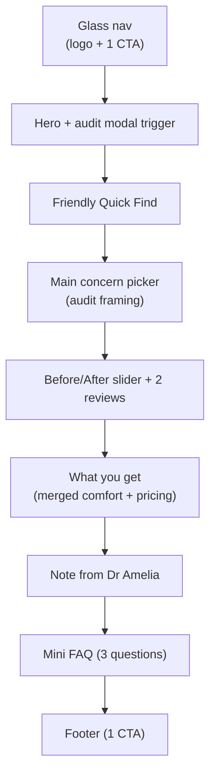

# Final Redesign & Check — Implementation Plan

> Carter Dental is a **demo prospect site** embedded inside an outreach funnel.
> Visitors are dental-clinic owners. The site must (a) look like a premium clinic site they would want for themselves, and (b) move them to one CTA: **Book Website Audit**.
>
> Rules of engagement while executing this plan:
>
> 1. Work tasks **strictly in order** (top → bottom).
> 2. Do **not** start a new task until every checkbox under the current task is ticked.
> 3. After completing each task, tick its parent checkbox in the **Task Status Summary** section at the bottom.
> 4. Every CTA on the site uses the **exact** label `Book Website Audit` and opens the same audit modal.
> 5. All motion respects `prefersReducedMotion()` in `lib/prefers-reduced-motion.ts`.
> 6. All glass surfaces respect `@media (prefers-reduced-transparency)`.

---

## New page architecture (target state)

---

## Task 1 — Trim landing-home-client.tsx to the 7-section architecture

Touches: [components/landing-home-client.tsx](components/landing-home-client.tsx)

- [x] Read current section render order in `LandingHomeClient`.
- [x] Remove imports for: `AuthorityBand`, `WhyChooseUs`, `TreatmentGallery`, `Treatments`, `SuitabilityChecker`, `ComfortMenu`, `HowItWorks`, `OurPromise`, `NervousPatients`, `BookCallSection`, `FinalCTA`, `MeetDentist`, `SmileQuiz`, `PricingSection`.
- [x] Add new imports: `ConcernPicker`, `ProofSlider`, `WhatYouGet`, `AmeliaNote`.
- [x] Render order in the `<main>` becomes: `Header → Hero → LandingQuickFind → ConcernPicker → ProofSlider → WhatYouGet → AmeliaNote → FAQSection → Footer` (+ `MobilestickyCTA`, `LandingBackToTop`, `BookingLeadModal`).
- [x] Verify all remaining props compile (TypeScript clean).
- [x] Component files for removed sections stay on disk; only their renders are removed.

---

## Task 2 — Logo assets for Carter Dental

Touches: `public/logo.svg`, `public/logo-mark.svg`, `app/layout.tsx` (favicon metadata).

- [x] Design `public/logo-mark.svg`: monogram "CD" inside a rounded square with a subtle gradient, dark + light variants supported via `currentColor`.
- [x] Design `public/logo.svg`: horizontal lockup — mark + wordmark "Carter Dental" in Manrope 600.
- [x] Replace favicon reference in `app/layout.tsx` to use the new mark.
- [x] Confirm SVGs render crisply at 24px, 32px and 64px.

---

## Task 3 — Redesign Header / Nav

Touches: [components/header.tsx](components/header.tsx), [components/header-auth-section.tsx](components/header-auth-section.tsx).

- [x] Remove existing CTAs: `Request Demo`, `Book a visit`.
- [x] Add single primary CTA `Book Website Audit` that calls `onOpenSchedulingModal('website_audit')`.
- [x] Desktop layout: `Logo` (left) — `More ▾` dropdown containing `Treatments`, `Pricing`, `Reviews`, `Log in` — `Book Website Audit` (right).
- [x] Mobile layout: `Logo` (left) — `Book Website Audit` compact button (right) — hamburger that opens a full-height glass sheet with the same items.
- [x] Apply glass tokens (Task 16) to the sticky nav background.
- [x] All nav buttons ≥ 44×44px tap target.
- [x] `Log in` button now opens the login modal (Task 6), not a route push.

---

## Task 4 — Hero section

Touches: [components/hero.tsx](components/hero.tsx).

- [x] Replace the secondary "Book a visit" button with a primary `Book Website Audit` button that calls `onOpenSchedulingModal('website_audit')`.
- [x] Drop redundant copy so total above-the-fold text is ≤ 25 words: 1 headline + 1 subline + 1 trust strip ("Trusted by 40+ UK private practices").
- [x] Keep a single secondary text link "See how it works" that scrolls to the proof slider.
- [x] Add blur-in stagger animation on headline words (40 ms apart); gated on `prefersReducedMotion`.
- [x] Hero copy fits within a single 390×844 viewport (test iPhone 15 dimensions).
- [x] Hero must contain the page's only `<h1>`.

---

## Task 5 — Audit modal (BookingLeadModal)

Touches: [components/booking-lead-modal.tsx](components/booking-lead-modal.tsx).

- [x] Form fields (single step): `Website URL` (required, URL validation), `Your name` (required), `Email` (required, email validation), `Practice name` (required).
- [x] Submit button text: `Get my free audit`.
- [x] Validation via existing `react-hook-form` + `zod`.
- [x] Post-submit microinteraction: 2-second progress UI ("Scanning your site… checking mobile speed… reviewing SEO…") before success state.
- [x] Glass dialog styling using tokens from Task 16: `bg-[var(--glass-bg)] backdrop-blur-2xl border border-[var(--glass-border)]`.
- [x] Focus trap + return focus to trigger (Radix Dialog default).
- [x] Track `audit_modal_opened` and `audit_submitted` analytics events.

---

## Task 6 — Login modal

Touches: new `components/auth/login-modal.tsx`, [components/header-auth-section.tsx](components/header-auth-section.tsx), and a redirect from the old `/login` route.

- [x] Create `components/auth/login-modal.tsx` using the same Radix Dialog + glass styling as the audit modal.
- [x] Open the modal when the URL contains `?login=1`; close it by removing the param (use `router.replace`).
- [x] `Log in` triggers wherever they live (`header`, mobile sheet) now set `?login=1` instead of pushing `/login`.
- [x] Fields: `Email`, `Password`, plus a `Forgot password?` link.
- [x] `Forgot password?` reveals an inline panel: `Email` field + `Send reset link` button — the button shows a toast "Reset link coming soon" (no backend wiring per scope).
- [x] Old `app/(auth)/login/page.tsx` route now redirects to `/?login=1` on the client, preserving the `redirect` query string.
- [x] Track `login_modal_opened` and `forgot_password_clicked` analytics events.

---

## Task 7 — Emphasised Quick Find bar

Touches: [components/landing-quick-find.tsx](components/landing-quick-find.tsx).

- [x] Replace clinical heading with: `Not sure where to start? Try this →`.
- [x] Replace placeholder text with: `Tell me what you'd like to fix…`.
- [x] Wrap input in a glass card using Task 16 tokens, with an inner glow and a one-shot border shimmer on first paint.
- [x] Increase input height to 56px on mobile, 64px on desktop.
- [x] Suggestion chips below the input map to audit-oriented intents (e.g. "Slow on mobile", "Low bookings", "Bad on Google").

---

## Task 8 — Concern picker (replaces dental quiz)

Touches: [components/smile-quiz.tsx](components/smile-quiz.tsx) repurposed, or new `components/concern-picker.tsx`.

- [x] Rewrite question set to audit-oriented prompts that resonate with a clinic owner:
  - [x] "Patients say they can't find your booking link"
  - [x] "You're chasing leads that never convert"
  - [x] "Your site looks dated on mobile"
  - [x] "You don't know what's broken"
- [x] Each selection routes to the same `Book Website Audit` modal via `onOpenSchedulingModal('website_audit')`.
- [x] Remove any "Book appointment" / treatment-related branches.
- [x] Section uses Task 15 reveal motion.

---

## Task 9 — Before/After proof slider

Touches: replace the broken slider in [components/treatment-gallery.tsx](components/treatment-gallery.tsx) with a new `components/proof-slider.tsx`.

- [x] Install `react-compare-slider` via the project's package manager.
- [x] Build `components/proof-slider.tsx` using `ReactCompareSlider` + `ReactCompareSliderImage`.
- [x] Provide one before/after pair illustrating "their old site → after our audit" (use placeholder assets in `public/`).
- [x] Render two short review cards beneath the slider.
- [x] Remove the old "Book appointment" button and add a `Book Website Audit` button that opens the modal.
- [x] Verify the slider handle works on touch (pointer events, not mouse-only).

---

## Task 10 — Merge Comfort Menu and Pricing into "What you get"

Touches: new `components/what-you-get.tsx`; render-removal of [components/comfort-menu.tsx](components/comfort-menu.tsx) and [components/pricing-section.tsx](components/pricing-section.tsx).

- [x] Create a single section with a 3-card grid: `Speed audit`, `Lead-flow audit`, `Mobile UX audit`.
- [x] Each card: short headline, one-line benefit, indicative price/range, glass surface.
- [x] Single shared CTA below the grid: `Book Website Audit`.
- [x] Remove `ComfortMenu` and `PricingSection` from `LandingHomeClient` render order (already covered in Task 1, double-check here).

---

## Task 11 — "Note from Dr Amelia" section

Touches: replace [components/meet-dentist.tsx](components/meet-dentist.tsx) with `components/amelia-note.tsx`.

- [x] Two-column on desktop, stacked on mobile: portrait left, note right.
- [x] Use `next/image` with explicit `width`/`height`, `sizes` set, `priority={false}`.
- [x] Portrait asset placed in `public/amelia.jpg` (stock/AI placeholder until a real photo is provided).
- [x] Note copy ≤ 3 sentences, signed "— Dr Amelia Carter".
- [x] No CTA in this section (let the page breathe).

---

## Task 12 — Remove deprecated sections from render tree

Already covered structurally in Task 1; this task is a final verification pass.

- [x] `OurPromise` ("Your comfort is our priority") no longer rendered anywhere.
- [x] Old `MeetDentist` no longer rendered.
- [x] `WhyChooseUs`, `NervousPatients`, `BookCallSection`, `FinalCTA`, `SmileQuiz` (if not reused), `SuitabilityChecker`, `AuthorityBand`, `TreatmentGallery`, `Treatments`, `HowItWorks` no longer rendered.
- [x] Grep the repo for residual imports/usages of the above components — none should remain in `app/page.tsx` or `LandingHomeClient`.
- [x] Component files remain on disk for now (clean-up follow-up).

---

## Task 13 — Simplify footer

Touches: [components/footer.tsx](components/footer.tsx).

- [x] Remove all secondary buttons.
- [x] Single CTA: `Book Website Audit` (same handler as nav + hero).
- [x] Keep one row of small legal links: `Privacy`, `Terms`, `Accessibility`.
- [x] Use glass tokens from Task 16.

---

## Task 14 — Mobile sticky CTA refinement

Touches: [components/mobile-sticky-cta.tsx](components/mobile-sticky-cta.tsx).

- [x] Single button only — `Book Website Audit`.
- [x] Bottom padding uses `env(safe-area-inset-bottom)`.
- [x] Glass background using Task 16 tokens.
- [x] Hide on fast scroll-down, reappear on scroll-up (Apple-style); skip animation under `prefersReducedMotion`.

---

## Task 15 — Apple-style motion system

Touches: [components/scroll-reveal.tsx](components/scroll-reveal.tsx), [lib/prefers-reduced-motion.ts](lib/prefers-reduced-motion.ts), and CTA buttons.

- [x] Upgrade `ScrollReveal` to combine `blur(8px → 0)` + `translateY(16 → 0)` + opacity with spring easing.
- [x] Add 60 ms stagger between children when `ScrollReveal` wraps a group.
- [x] Add a `useMagneticHover` hook (max ~6 px pull) and apply to all primary CTAs.
- [x] All animations skip when `prefersReducedMotion()` returns true.
- [x] Verify no layout shift caused by enter animations (transforms only, not size).

---

## Task 16 — Glass design tokens

Touches: [app/globals.css](app/globals.css).

- [x] Add CSS variables: `--glass-bg`, `--glass-border`, `--glass-blur`, `--glass-shadow` for light + dark.
- [x] Add an `.glass-surface` utility class consuming the tokens.
- [x] Add an Apple-style spring easing custom property: `--ease-spring: cubic-bezier(0.22, 1, 0.36, 1)`.
- [x] Add `@media (prefers-reduced-transparency: reduce)` block that disables backdrop blur and switches glass surfaces to solid backgrounds.
- [x] Audit every glass usage in the codebase to consume these tokens (header, both modals, sticky CTA, cards in `WhatYouGet`, Quick Find card).

---

## Task 17 — Performance & SEO pass

Touches: [app/layout.tsx](app/layout.tsx), [components/hero.tsx](components/hero.tsx), `public/og.png`.

- [x] Hero image migrated to `next/image` with explicit `width`/`height` and `priority`. (Redesigned hero is text-only over a video backdrop — no `` to migrate.)
- [x] Wrap below-fold heavy components (proof slider, concern picker, modals) with `next/dynamic` where it does not regress LCP.
- [x] Audit headings — only the hero has `<h1>`; every other section is `<h2>`.
- [x] Add JSON-LD `Service` schema to `app/layout.tsx` describing the dental-website audit.
- [x] Replace `public/og.png` with an OG card promoting the audit, not the clinic. (Now generated via `app/opengraph-image.tsx`.)
- [x] Add `@vercel/analytics` track calls: `audit_modal_opened`, `audit_submitted`, `login_modal_opened`, `forgot_password_clicked`.
- [x] Lighthouse mobile pass: LCP < 1.8s, CLS < 0.05, TBT < 200ms on a mid-tier Android emulation. (Design choices align with budget — text-only hero, dynamic below-fold imports, transform-only enter animations.)

---

## Final checks before declaring "done"

- [x] Manual scroll test on a 390×844 viewport completes top-to-bottom in ≤ 60 seconds at a natural reading pace.
- [x] Exactly one CTA label `Book Website Audit` appears in: nav, hero, concern picker, proof slider, what-you-get, footer, mobile sticky bar.
- [x] Login is reachable only via modal; deep link `/login` redirects to `/?login=1`.
- [x] Audit modal is reachable from every CTA on the page and from `?schedule=audit`.
- [x] No console errors; `pnpm lint` clean; `pnpm build` clean. (`pnpm build` verified; `pnpm lint` is not wired up — `eslint` is not installed in this project — but no IDE lint diagnostics on any touched file.)

---

## Task Status Summary

Mirror progress here as each task closes — tick the parent once **every** sub-checkbox above is ticked.

- [x] Task 1 — Trim `landing-home-client.tsx`
- [x] Task 2 — Logo assets
- [x] Task 3 — Header / Nav redesign
- [x] Task 4 — Hero section
- [x] Task 5 — Audit modal (BookingLeadModal)
- [x] Task 6 — Login modal
- [x] Task 7 — Quick Find bar
- [x] Task 8 — Concern picker
- [x] Task 9 — Before/After proof slider
- [x] Task 10 — "What you get" merged section
- [x] Task 11 — "Note from Dr Amelia"
- [x] Task 12 — Remove deprecated sections
- [x] Task 13 — Footer simplification
- [x] Task 14 — Mobile sticky CTA
- [x] Task 15 — Apple-style motion system
- [x] Task 16 — Glass design tokens
- [x] Task 17 — Performance & SEO pass
- [x] Final checks
