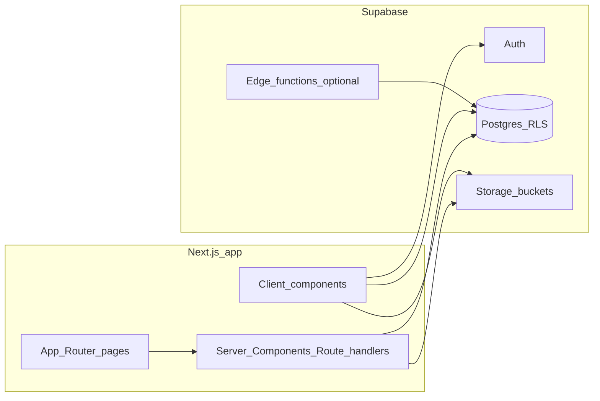
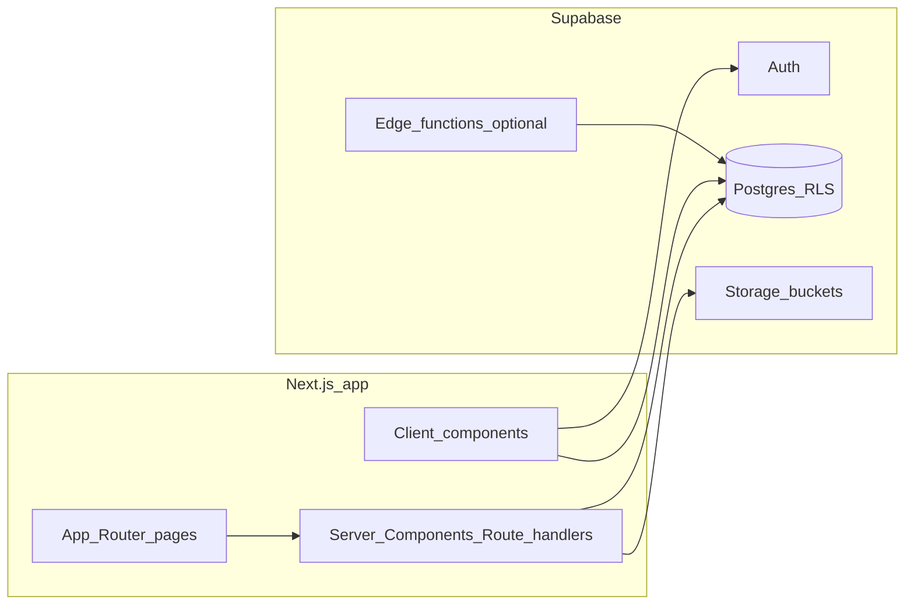
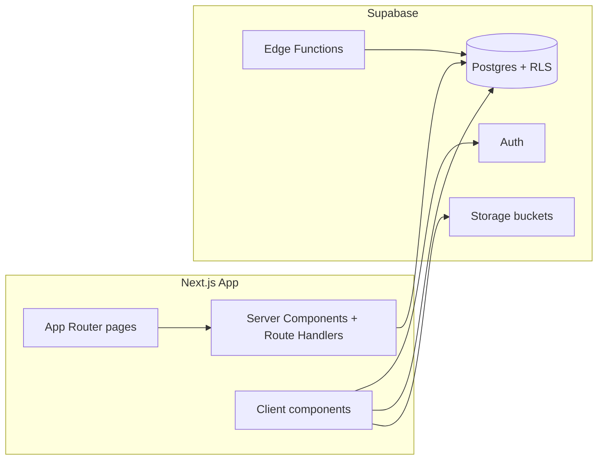

# First backend implementation plan (merged)

This file merges **two** Cursor plans into one readable document. **Nothing was removed** from either source: overlapping ideas are consolidated once; unique items from each plan appear in full. When execution starts, the primary written artifact should still be **`IMPLEMENTATION_PLAN.md`** at the repo root (detailed, step-by-step), as described in the first source.

**Stack context (both plans):** Next.js 16 (App Router), React 19, Tailwind 4, shadcn/ui (`components/ui/`), Manrope via `app/layout.tsx`, Carter Dental Studio branding.

**Out of scope (both):** Online payments; note “pay in person” on booking confirmation copy. Stripe deferred; optional future hook points (e.g. `payment_status = in_person`).

---

## Revised execution order (current)

This section supersedes the *initial sequencing* of the phased sections below for the **next implementation pass**. The full data model, RLS, and route map elsewhere in this document still apply; only **when** things are built changes.

1. **Supabase first** — Project, Auth settings, env vars, SQL migrations for **all** planned tables (including `profiles` with `role` and related enums), indexes, soft-delete columns, profile sync trigger(s), and **RLS** with `is_admin()` / `is_staff()` (or equivalent) so the database is complete before UI work depends on it.
2. **Signup and login** — Next.js: `@supabase/ssr`, `middleware.ts` session refresh, `/signup` and `/login` (plus `/auth/callback` and logout as needed). New signups get default role **`user`** (or as normalized in migrations); elevated roles are never self-assigned in the app.
3. **Roles and manual admin** — Role logic lives in `profiles` + RLS + middleware route protection. **Do not** build in-app admin promotion for the first slice. After migrations are applied, **create the first admin manually** in Supabase (e.g. ensure the user exists in Auth, then set `profiles.role = 'admin'` for that user).
4. **Mock dashboards** — Lightweight **admin** and **user/client** dashboard pages (placeholders are fine: layout shell, “you are logged in as …”, role badge, links to sign out). Use these to manually test: register → login → access user routes; login as manually promoted admin → access admin routes; confirm non-admin cannot reach `/admin/**`.

After this slice is verified, continue with catalog CRUD, `/book`, full dashboards, availability, history, and QA per **Phased implementation** below.

---

## Locked product decisions (combined)

- **Session model — full picture:**  
  - **`session_categories`** (admin-defined labels; CRUD; optional `deleted_at` for catalog hygiene) + **`session_types`** (templates: table CRUD, optional seed rows—not TypeScript enums) + **`sessions`** (calendar instances / slots: start/end, capacity, pricing/location overrides, `session_type_id`, status, soft delete).  
  - First plan emphasizes **`session_types`** + **`sessions`**; second plan adds **`session_categories`**, **`practice_settings`** (e.g. **`max_advance_booking_days`**), and explicit **advance booking window** enforcement for client-facing “available sessions” (including generated/recurring slots).
- **Admin bootstrap:** First admin promoted **manually** in Supabase (e.g. `profiles.role = 'admin'`). Future staff/admin via **Admin → User management** (`/admin/users`)—no self-service admin signup.
- **Soft delete:** **`deleted_at`** (`timestamptz`, nullable) on **`bookings`** and **`sessions`**; do not `DELETE` rows for normal cancellation or admin removal—**update** `deleted_at` (and optional `cancel_reason`, `cancelled_at` on bookings where distinct). **Session types:** first plan recommends **`session_types.deleted_at`** for auditable catalog churn; document if omitted.
- **RLS:** Clients only their own bookings (and scoped session info); admins (and staff if modeled) full visibility for operations and reporting.
- **Branding:** **`DESIGN_TOKENS.md`** (palette + Card/Table dashboard patterns) aligned with `app/globals.css` / Tailwind / shadcn.
- **UX:** Prefer **slug-based pages** over large modals; modals for confirmations and small edits; **toasts top-left** (standardize Radix toast viewport in `components/ui/toast.tsx` or Sonner—pick one system).

---

## Architecture (high level)

Both plans use the same shape; minor wording differences are merged below.

- **Frontend:** App Router, existing Shadcn-style UI, Manrope.
- **Backend:** Supabase Postgres (source of truth), Auth, Storage for media; Edge Functions for non–client-trusted workflows (invites, slot generation, privileged RPCs, auth webhooks for login history, etc.).
- **Pattern:** Server client in Server Components / Route Handlers; browser client where needed with RLS; **service role** only server-side or in Edge Functions—never expose to client.
- **IDs:** Second plan specifies **UUID primary keys** everywhere for auth linkage and merge-friendly history.

---

## A. Soft delete strategy (mandatory)

**Requirement:** **`deleted_at`** on **`bookings`** and **`sessions`**. Rationale (second plan): medical/dental context—preserve who was supposed to show up; soft-delete hides from default scheduling UIs while retaining audit/reporting.

**Implementation notes (first plan):**

- Queries use **`WHERE deleted_at IS NULL`** in app code **and** RLS (soft-deleted rows invisible to clients; admins may still `SELECT` for reporting—per policy design).
- **Capacity:** Counts for “spots left” **exclude** soft-deleted bookings (or include only in audit reports).
- **Optional clarity:** Distinguish **cancellation** (business state: `status`, `cancel_reason`, `cancelled_at`) from **soft delete** (hide/purge from default lists while retaining history).

**Second plan addition:** Session cancellation sets `status`, `cancel_reason`, `cancelled_at`—**distinct** from **`deleted_at`** (soft delete = remove from public calendar; cancellation = business event).

---

## B. Row Level Security and RBAC (mandatory)

**Explicit instruction:** **Include RLS** on all relevant tables. **Clients:** only **their own bookings** (and related session info needed to render them). **Admins (and staff if used):** everything needed for operations and reporting.

**Suggested RBAC model:**

- **`profiles`** (1:1 `auth.users`): `id`, `role` (`user` | `client` | `staff` | `admin`), `status` (first plan: `active` | `pending` | `rejected` | `banned`; second plan: `active` | `suspended` | `banned` | `pending_review`—**normalize to one enum in migrations**), display name, phone, optional `avatar_url`, timestamps.
- **Role transitions:** New signup → `user`; first successful booking → **`client`** (trigger or transactional booking RPC). Admin **reject/ban** from User management (`status`; optional `banned_at`, `ban_reason`, `moderation_note` or `profile_moderation_events`).
- **Helpers:** Postgres **`is_staff()`** / **`is_admin()`** reading `profiles` for `auth.uid()`; use in policies.

**Minimum policy sketch (implement in SQL migrations):**

| Table / area | Client | Admin/staff |
|--------------|--------|-------------|
| `bookings` | `SELECT`/`UPDATE` own (insert per booking flow) | Full |
| `sessions` | `SELECT` non-deleted bookable future slots + slots they booked | Full |
| `session_types` | `SELECT` active types | Full CRUD |
| `session_categories` | `SELECT` active (catalog) | Full CRUD |
| `profiles` | `SELECT`/`UPDATE` own | Read/update others for management |
| `practice_settings` | No direct access or read-only public fields via RPC (second plan) | Read/update |
| Audit/history | Own-related where applicable | Read all |

**JWT / claims:** Prefer **RLS on `profiles.role`** over duplicating role in JWT unless using a **custom access token hook**; document in migrations.

**Writes to role/status:** Prefer **Edge Function** or **`SECURITY DEFINER` RPC** for promotions to avoid privilege escalation (second plan).

**Tests:** Supabase policy tests (SQL or pgTAP) and/or integration tests; non-privileged JWT checks before go-live (second plan: “RLS penetration checks”).

---

## C. Verbatim implementing-agent requirements (from second plan)

Follow these during implementation:

**A — Soft delete:** Use **`deleted_at`** on **`bookings`** and **`sessions`** instead of permanently deleting those rows for operational records in-scope.

**B — RLS:** Include **RLS** on all relevant tables; clients only own bookings; admins full practice visibility; verify with non-privileged JWTs before go-live.

**C — `DESIGN_TOKENS.md`:** Tracked doc; shadcn/Tailwind-aligned palette with example hex values mapped from `app/globals.css`, e.g. primary teal/sage `#5a9a9a` (aligns with `app/layout.tsx` themeColor / `--primary` oklch), secondary cream `#f7f7f5`, foreground `#2d2d33`; standard dashboard **Card** and **Table** layouts that **all** admin and client dashboard pages follow.

**Admin accounts:** First admin via Supabase console; future staff/admin via **Admin → User management**, not public self-signup for elevated roles.

---

## Data model (tables to plan for — union of both plans)

### Core identity

- **`profiles`:** As in RBAC section; link to auth user; optional **`user_roles`** many-to-many only if one person needs staff + client scopes (second plan).

### Catalog & sessions

- **`session_categories`:** (second plan) `id`, `name`, `slug` (optional), `sort_order`, `is_active`, timestamps, optional `deleted_at`. Admin: `/admin/categories`.
- **`session_types`:** Template fields including **`category_id`** (nullable FK) where used; slug, title, description, duration, price (`price_cents` or numeric), currency, default max slots, location (`location_id` or freeform), `active`/`is_active`, optional `metadata` jsonb, recommended **`deleted_at`** (first plan).
- **`sessions`:** `session_type_id`, `starts_at`, `ends_at`, optional `timezone` (IANA), `max_slots`, price override, `location_*` overrides, `status` (e.g. `scheduled` | `cancelled` | `completed`), **`deleted_at`**, `notes`, cancellation fields as needed.
- **`availability_rules` / `availability_exceptions`:** (both) Recurrence or blackouts; tie to generated or explicit **`sessions`** depending on materialized slots (recommended) vs compute on the fly. Second plan: **`max_advance_booking_days`** from **`practice_settings`** applies when listing bookable sessions for clients.

### Practice settings

- **`practice_settings`** (single row or keyed): **`max_advance_booking_days`** (integer; default e.g. 60–90), timezone, practice name, contact info, cancellation copy, feature flags, notification prefs, locations list as needed. **UI:** `/admin/settings`; **enforcement** in queries/RPC for `/book` and client flows (admins may bypass for planning).

### Bookings

- **`bookings`:** `user_id`, `session_id`, optional denormalized `session_type_id`, `status` (`pending` | `confirmed` | `cancelled` | `completed` | `no_show`), `cancel_reason`, `cancelled_at`, **`deleted_at`**, patient/client notes, admin notes, timestamps.

### History / audit (append-only)

| Table | Notes |
|-------|--------|
| **`login_history`** / **`auth_login_history`** | `user_id`, `occurred_at`, `ip`, `user_agent`, `method`, optional `success`—populate via Edge/webhook/secure pipeline; rate-limit / GDPR (first plan). |
| **`session_history`** | Insert/update/status/soft delete—who/when/what (JSON `diff` optional). **Second plan:** implement as specified. |
| **`booking_history`** | Same for bookings. |
| **`admin_actions`** / **`audit_log`** | Actor, action, entity, metadata (bans, role changes, exports). |
| **`media_audit`** | (First plan) storage object key, action. |

**Second plan:** **`media_assets`** optional for Storage; buckets e.g. `avatars`, `clinical-docs` (private if in scope).

**Indexes (both):** `(sessions.starts_at)`, `(bookings.user_id, created_at)`, partial indexes **`WHERE deleted_at IS NULL`**.

---

## App structure: routes and UX principles

**Principles:** Unique pages with slugs; modals for confirmations and small field edits; toasts **top-left**; shared dashboard shell (sidebar `components/ui/sidebar.tsx`), tables, forms, empty states (`components/ui/empty.tsx`).

### Combined route map

| Area | Routes |
|------|--------|
| Auth | `/login`, `/signup`, `/logout`, `/forgot-password`, `/auth/callback` (first plan); `/profile` or `/account`, `/account/security` (first plan variants) |
| Public | `/`, `/book` (wire to real data) |
| Client | `/app` or `/client`, `/client/bookings`, `/client/bookings/[id]` |
| Admin | `/admin`, `/admin/categories` (second), `/admin/session-types` or `/admin/session-types/[id]`, `/admin/sessions`, `/admin/sessions/[id]`, **`/admin/calendar`** (first plan—month/week + booking counts), `/admin/bookings`, `/admin/bookings/[id]`, `/admin/clients`, `/admin/clients/[id]` or `[userId]`, `/admin/reporting`, `/admin/settings`, **`/admin/users`** |
| Optional | `/admin/audit` (second plan phase 2), `/legal` or terms/privacy links |

**Second plan route detail:** `/admin/settings` includes **max advance booking window** and validation; `/admin/reporting` charts (reuse recharts per `package.json`); forgot/reset password for email recovery.

---

## Reporting, settings, payments

- **Reporting v1 (first plan):** KPI cards (bookings this week, no-shows, utilization), CSV export filtered by date—read-only via RLS-compliant queries or server export **after** auth check with service role.
- **Settings:** Practice name, default timezone, cancellation copy, retention notes; feature flags booking open/closed; **max advance booking** (second plan).

---

## Edge Functions (when to use — combined)

- Webhooks: auth events → login history.
- Transactional: slot generation, email/SMS later, nightly cleanup **without** hard deletes—archive flags only.
- Privileged admin actions: bulk cancel, role changes if not using RPC; **invite emails**.

---

## UI/UX conventions (combined)

- **Toasts:** Top-left; fix Radix viewport (`fixed left-4 top-4`) or Sonner `position="top-left"`—one system only.
- **Dashboard shell:** Sidebar, breadcrumbs, page title, primary actions.
- **Loading/empty:** `skeleton.tsx`, `empty.tsx`.
- **Admin IA (approved):** Left sidebar nav includes `treatment types`, `clients`, `bookings`; each area supports CRUD flows on dedicated pages.
- **Overview navigation:** Keep summary cards under header and add quick links for common admin actions.
- **Header account menu:** Top-right profile image + user name opens the same branded dropdown style used on the root page.
- **Mobile-first behavior:** Start with phone layout; collapsible/off-canvas sidebar, touch-safe targets, responsive table fallbacks (horizontal scroll + compact row actions), and profile dropdown behavior tuned for small screens.
- **Visual style:** Introduce subtle glassmorphism on summary cards while preserving readability/contrast and token compliance.
- **Second plan “Do / Don’t”:** Avoid arbitrary hex outside tokens; optional admin layout without film-grain if it hurts readability.

---

## Realtime notification centre (scope expansion before implementation)

Add a dedicated, real-time notification center to support operational awareness in admin workflows.

### Product scope (v1)

- In-app notification bell in admin header with unread count.
- Dropdown/panel for latest items and a full notifications page for history.
- Notification types: new booking, booking cancellation, booking reschedule, new client signup, session capacity threshold reached, and system/admin announcements.
- Actions: mark read/unread, mark all as read, deep-link to related entity (`booking`, `client`, `session`).
- Priority/severity labels (`info`, `warning`, `critical`) with visual hierarchy.

### Data + backend requirements

- Add `notifications` table (UUID, `recipient_user_id`, `type`, `title`, `body`, `entity_type`, `entity_id`, `cta_url`, `severity`, `is_read`, `read_at`, `created_at`, optional `metadata` jsonb).
- Add indexes for `recipient_user_id`, `is_read`, `created_at DESC`.
- RLS: users can read/update only their own notifications; admins can create/broadcast via trusted server paths only.
- Create trusted write path for system events (Edge Function, server action, or DB trigger pipeline) so clients cannot spoof notifications.
- Use Supabase Realtime channel subscription for live delivery in admin UI.

### UX + operational requirements

- Mobile-first tray/panel behavior and keyboard accessibility on desktop.
- Batch updates to reduce noisy UI refresh (debounced unread count updates).
- Offline/resume behavior: fetch latest unread count and missed notifications on reconnect.
- Retention policy: archive/prune old notifications (e.g. 90-180 days) and document in privacy/ops notes.

---

## Contextual quick actions (admin overview + list pages)

Provide role-aware, context-sensitive quick actions to reduce navigation hops:

- Global quick actions on overview: `New treatment type`, `Add client`, `Create booking`, `Open today’s bookings`.
- Contextual actions per module:
  - `treatment types`: create, duplicate, archive, restore.
  - `clients`: add client, open profile, create booking for client, suspend/unsuspend.
  - `bookings`: confirm, reschedule, cancel, mark no-show, restore archived.
- Guardrails: confirmation dialogs for destructive actions, clear undo/restore path where possible, and toast feedback for all mutations.
- Mobile-first: expose actions through compact action sheet / dropdown instead of dense inline buttons.

---

## DESIGN_TOKENS.md (mandatory deliverable — combined)

Create **`DESIGN_TOKENS.md`** (repo root or `/docs`) locking:

- **Colors:** Canonical **CSS variables** in `app/globals.css` (oklch teal/sage, cream, destructive, border, radius); **hex reference** for stakeholders (examples from second plan: `background` `#fcfcfb`, `foreground` `#2d2d33`, `primary` `#5a9a9a`, `secondary` `#f7f7f5`, `muted`, `accent`, `destructive`, `border`, `ring`—refine against computed values).
- **Typography:** Manrope; dashboard `h1`–caption mapping to Tailwind.
- **Spacing/radius:** `--radius` 1.5rem; cards `p-6`, section gaps `gap-6` / `space-y-6`.
- **Card layout:** Page title + actions → **Card** with `CardHeader` / `CardContent` / `CardFooter`; `max-w-6xl` or full width with padding aligned to marketing.
- **Table layout:** Card wraps **Table**; toolbar search/filter; responsive scroll; empty state.
- **Tailwind semantic classes:** Document `bg-background`, `text-foreground`, etc.; **new pages must not introduce arbitrary hex** without updating `DESIGN_TOKENS.md` and `app/globals.css`.

**Goal:** Any new dashboard page copies the same skeleton; single reference for AI and humans.

---

## Phased implementation

### Summary steps (from first plan — for IMPLEMENTATION_PLAN.md detail)

**Note:** The **Revised execution order** section above is the active sequence for the first milestone: full Supabase schema → auth pages → manual admin → mock dashboards → then the steps below.

1. Supabase project: Auth, Storage, URL redirects.
2. Migrations: tables, enums, triggers (profile on signup, role on first booking), soft-delete, audit.
3. RLS: all user-facing tables; policies + tests.
4. Next.js: `@supabase/ssr`, middleware for `/admin/*` and `/client/*`.
5. UI: dashboard shell, tables, forms, single toast system.
6. **Feature slices:** Session types CRUD → Sessions/calendar → Public booking → Client bookings → Admin reporting.

**Testing:** Supabase policy tests and/or integration tests for “client cannot read others’ bookings.”

### Detailed phases (from second plan — step-by-step)

- **Phase 0 — Project setup:** Supabase project; env vars (`NEXT_PUBLIC_SUPABASE_URL`, `NEXT_PUBLIC_SUPABASE_ANON_KEY`, `SUPABASE_SERVICE_ROLE_KEY` server-only); `@supabase/supabase-js` + `@supabase/ssr`; `middleware.ts` session refresh.
- **Phase 1 — Schema + RLS + soft delete:** Migrations including `session_categories`, `session_types`, `practice_settings`, `deleted_at` on bookings/sessions; indexes; RLS + helpers; optional seed session types as **rows**. **First admin** is created only **after** this phase, **manually** in Supabase (not via app signup).
- **Phase 2 — Auth & profile:** `/login`, `/signup`, `/profile`; profiles sync trigger on `auth.users` insert. **Early milestone:** ship signup/login **before** full catalog work; add **mock** admin and user dashboard pages to validate roles (see **Revised execution order**).
- **Phase 3 — g & sessions (admin):** CRUD categories → session types → session instances; validation; cancellation vs soft-delete semantics.Catalo
- **Phase 4 — Booking (client):** Replace demo on `app/book/page.tsx`; enforce `max_advance_booking_days`; role promotion `user` → `client`; client booking pages.
- **Phase 5 — Admin dashboards:** Overview, bookings, sessions, clients, reporting, settings (incl. max advance), users.
- **Phase 6 — Availability engine:** CRUD `availability_rules` / exceptions; optional generator respecting advance window.
- **Phase 7 — History, media, functions:** Triggers/app writes for histories; login pipeline; Storage optional.
- **Phase 8 — QA:** E2E signup → book → admin confirm; RLS checks; runbooks (soft-delete restore, GDPR export future).

### Phase 3 (Admin) checklist — updated

- [x] **Navigation shell (mobile-first):** left sidebar with `treatment types`, `clients`, `bookings`; default mobile layout with collapsible/off-canvas behavior and touch-safe targets.
- [x] **Header account control:** top-right profile image + user name; on click/tap open the same branded root-page dropdown style; ensure small-screen positioning and dismissal behavior.
- [x] **Wayfinding:** breadcrumbs on all admin pages and clear active state in sidebar.
- [x] **Overview structure:** retain summary cards below header; add contextual quick actions and quick links (e.g. new treatment type, add client, create booking, open today’s bookings).
- [x] **Table UX baseline:** searchable, filterable, sortable, paginated tables across treatment types/clients/bookings with loading and empty states.
- [x] **Destructive safeguards:** confirmation dialogs for delete/archive/cancel, explicit destructive styling, toast outcomes, and restore/undo path where supported.
- [x] **Treatment types CRUD:** create/edit/duplicate/archive/restore categories and related treatment type rows with soft-delete-safe semantics.
- [x] **Clients CRUD:** create/edit/suspend/unsuspend/archive/restore client records with role/status-safe guardrails.
- [x] **Bookings CRUD:** create/confirm/reschedule/cancel/no-show/archive/restore flows with status and audit/history compatibility.
- [x] **Glassmorphism usage:** apply subtle glassmorphism to summary cards only; keep text contrast AA+, avoid visual noise, and remain token-compliant per branding docs.
- [x] **Realtime notification center (v1):** bell + unread badge in header, notification panel/list page, mark read/unread, mark all read, deep links to entities, priority levels.
- [ ] **Realtime notification center (backend readiness):** `notifications` table + indexes, strict RLS, trusted event write path (server/edge/trigger), Supabase Realtime subscription, reconnect/backfill strategy, and retention/pruning policy.

When leaving plan mode, **create `IMPLEMENTATION_PLAN.md`** at project root with phased detail and implement phase-by-phase (second plan deliverables table).

---

## Risks / follow-ups (first plan)

- **GDPR / retention:** Login and audit logs—document purpose and retention in privacy policy.
- **Stripe:** Deferred.

---

## Key product clarifications (second plan §10 — preserved)

- **`deleted_at` vs cancellation:** Use **both**—cancellation is business state; soft delete removes erroneous rows from scheduling while retaining audit linkage.
- **Payments:** Price from session types / booking snapshot; in-practice copy only.
- **Session types & categories:** CRUD in Postgres; optional starters are **seed data**, not app enums.
- **Advance booking:** **`practice_settings.max_advance_booking_days`** limits client booking horizon—including recurring/generated slots; configure on **`/admin/settings`**.

---

## Agent checklist (first plan — quick reference)

- [ ] Session **types** vs **instances**; soft delete on **bookings** + **sessions**; categories + practice settings if using second plan scope.
- [ ] **RLS:** clients = own bookings; admins see all (plus staff if used).
- [ ] **`DESIGN_TOKENS.md`** with palette + Card/Table patterns.
- [ ] Toasts **top-left**; slug pages over heavy modals.
- [ ] First admin via Supabase console; ongoing staff via **Admin → User management**.
- [ ] **Admin dashboard shell:** left sidebar (`treatment types`, `clients`, `bookings`), breadcrumbs, header profile avatar + name + branded root-style dropdown.
- [ ] **Overview layout:** summary cards retained below header + quick links + contextual quick actions.
- [ ] **CRUD UX baseline:** searchable/sortable/filterable/paginated tables, empty states, loading skeletons, row actions.
- [ ] **Destructive safeguards:** confirmation modals for delete/archive/cancel + audit-safe soft delete + toast result feedback.
- [ ] **Mobile-first/responsive:** collapsible sidebar, touch-first spacing, responsive table behavior, dropdown ergonomics on small screens.
- [ ] **Notification centre:** realtime unread badge, notification panel/list page, mark read/unread, deep links, event pipeline + RLS.
- [ ] **Glassmorphism:** apply subtle glass card style to summary cards only, preserving token usage, readability, and contrast.

---

## Deliverables checklist (second plan §11)

| Deliverable | Notes |
|-------------|--------|
| Supabase schema + migrations | Includes `session_categories`, `practice_settings`, soft deletes |
| RLS policies | Client isolation + admin override |
| Next.js auth + route groups | Optional `(marketing)`, `(app)`, `(admin)` |
| Admin & client dashboards | Card/Table per DESIGN_TOKENS |
| `DESIGN_TOKENS.md` | Tokens + layout recipes |
| `IMPLEMENTATION_PLAN.md` | Living master plan at repo root when executing |

---

## Source A — full text: `dental_backend_dashboards_ef60fe76.plan.md` (preserved)

The following is the **complete** body of the first plan (excluding duplicate YAML), so no information is lost in merge.

---

# Backend + dashboards implementation plan (updated)

When you approve execution, the primary written artifact should be **[IMPLEMENTATION_PLAN.md](IMPLEMENTATION_PLAN.md)** at the repo root (detailed, step-by-step). This plan is the consolidated source of truth including your latest decisions.

---

## Locked product decisions

- **Data model:** A **`session_types`** table holds templates (title, description, duration, default pricing, default max slots, default location fields, etc.). A **`sessions`** table holds **specific calendar instances/slots** (start/end or start + duration, capacity, pricing overrides if needed, location override, link to `session_type_id`, status, soft delete).
- **Admin bootstrap:** The **first admin is promoted manually** in the Supabase dashboard (e.g. set `profiles.role = 'admin'` or equivalent for your chosen role column). **Future staff** are managed from an **Admin → User management** page (invite, role change, ban/reject flows as designed below)—no self-service admin signup.

---

## Architecture (high level)

- **Frontend:** Keep the current stack: Next.js App Router, React 19, Tailwind 4, existing Shadcn-style UI under [`components/ui/`](components/ui/), Manrope via [`app/layout.tsx`](app/layout.tsx).
- **Backend:** Supabase Postgres (source of truth), Auth, Storage for media; Edge Functions for workflows that must not be client-trusted (e.g. promoting roles only via service role or controlled RPC—see Security).
- **Payments:** Out of scope; note “pay in person” on booking confirmation copy.

---

## A. Soft delete strategy (mandatory for implementer)

**Requirement:** Use **`deleted_at` timestamps** (nullable `timestamptz`) on **`bookings`** and **`sessions`** (calendar instances). **Do not** `DELETE` these rows for normal cancellation or admin removal—**update** `deleted_at` (and optional `cancel_reason`, `cancelled_at` on the booking if distinct from soft-delete semantics).

**Implementation notes:**

- All normal queries use **`WHERE deleted_at IS NULL`** in app code **and** enforce visibility in **RLS** (policies should treat soft-deleted rows as invisible to clients; admins may still `SELECT` for reporting—see RLS section).
- **Uniqueness / capacity:** Enforce slot capacity with counts that **exclude** soft-deleted bookings (or include them only for audit reports, not for “spots left”).
- **Session types:** Strongly recommend **`session_types.deleted_at`** as well so catalog churn is auditable; if omitted, document why (minimal scope).

**Optional clarity:** Distinguish **“cancelled by patient/staff”** (business state) from **“row hidden/removed from UI”** (soft delete). Typical pattern: `bookings.status` + `cancelled_at`/`cancel_reason`, and `deleted_at` only for admin purge/hide from default lists while retaining history.

---

## B. Row Level Security and RBAC (mandatory for implementer)

**Explicit instruction for whoever implements:** **Include Row Level Security (RLS) policies.** **Clients must only see their own bookings** (and related session info needed to render those bookings). **Admins (and staff, if modeled)** **must be able to see everything** required for operations and reporting.

**Suggested RBAC model:**

- **`profiles`** (or extend Supabase `auth.users` via trigger): `id` (FK to `auth.users`), `role` (`user` | `client` | `staff` | `admin`), `status` (`active` | `pending` | `rejected` | `banned`), timestamps, display name, phone, etc.
- **Role transitions:** New signup → `user`; first successful booking → **`client`** (via trigger or transactional booking RPC). Admin can **reject/ban** from User management (updates `status`; optional `banned_at`, `ban_reason`).
- **Helper:** Postgres function **`is_staff()`** / **`is_admin()`** reading `profiles` for `auth.uid()`; use in policies to avoid duplication.

**Minimum policy sketch (to be written in SQL migrations):**

| Table / area | Client | Admin/staff |
|--------------|--------|-------------|
| `bookings` | `SELECT`/`UPDATE` own rows only (insert rules for booking flow) | Full |
| `sessions` | `SELECT` non-deleted **bookable** future slots needed for booking UI + slots they booked | Full |
| `session_types` | `SELECT` active types | Full CRUD |
| `profiles` | `SELECT`/`UPDATE` own profile | Read/update others for management |
| Audit/history tables | Insert own-related events where applicable | Read all |

**JWT / claims:** Prefer **RLS on `profiles.role`** over duplicating role in JWT unless you add a **custom access token hook**; document the chosen approach in migrations.

**Edge Functions / service role:** Use **sparingly** for: first admin bootstrap (you’ll do manually anyway), **invite emails**, or **trusted server actions** in Next.js with **service role** only on the server—never expose service key to the client.

---

## Data model (tables to plan for)

**Core**

- **`session_types`:** Template fields: slug, title, description, duration minutes, default price, currency, default max slots, default location label/address fields, sort order, `active`, `deleted_at` (recommended), metadata JSON optional.
- **`sessions`:** `session_type_id`, `starts_at`, `ends_at` (or `starts_at` + duration denormalized), `max_slots`, `price` override nullable, `location_*` overrides nullable, `status` (e.g. `scheduled` | `cancelled` | `completed`), **`deleted_at`**, maybe `notes` (internal).
- **`availability_rules` / `availability_exceptions`:** Recurrence or date-range rules for when a session type is offered; exceptions for holidays/closures. Tie exceptions to **generated or explicit `sessions`** depending on whether you **materialize slots** (recommended for capacity and booking UX) vs compute on the fly.
- **`bookings`:** `user_id`, `session_id`, `status` (`pending` | `confirmed` | `cancelled` | `completed` | `no_show`), `cancel_reason`, `cancelled_at`, **`deleted_at`**, timestamps, optional patient notes.
- **`profiles`:** As above; link to auth user.

**History / audit (append-only)**

- **`login_history`:** `user_id`, `occurred_at`, `ip` (if available), `user_agent`, `method` (password, magic link, etc.).
- **`session_history`:** On `sessions` insert/update/status change/soft delete—who/when/what (JSON `diff` optional).
- **`booking_history`:** Same for bookings.
- **Other useful audit:** **`admin_actions`** (target user, action: ban, role change), **`media_audit`** (storage object key, action). Rate-limit sensitive logging to stay GDPR-aware (document retention policy in settings later).

**Indexes:** `(sessions.starts_at)`, `(bookings.user_id, created_at)`, partial indexes on `deleted_at IS NULL`.

---

## App structure: routes and UX principles

**Principles (from you):** Prefer **unique pages with slugs** over large modals; use **modals** for **confirmations** and **small field edits**; **toasts top-left** (align existing Radix toast viewport in [`components/ui/toast.tsx`](components/ui/toast.tsx)—today it shifts to bottom-right at `sm+`; standardize on **fixed top + left** for all breakpoints).

**Suggested route map**

| Area | Routes (examples) |
|------|---------------------|
| Auth | `/login`, `/signup`, `/logout` (action/route handler), `/forgot-password`, `/auth/callback` |
| Account | `/account` or `/profile`, `/account/security` |
| Client app | `/app` or `/client` dashboard home, `/client/bookings`, `/client/bookings/[id]` |
| Admin app | `/admin` dashboard, `/admin/sessions`, `/admin/sessions/[id]`, `/admin/session-types`, `/admin/session-types/[id]`, `/admin/bookings`, `/admin/clients`, `/admin/clients/[id]`, `/admin/reporting`, `/admin/settings`, **`/admin/users`** (User management) |
| Public | Keep `/`, `/book`—wire to real data when ready |

**Additional pages worth adding**

- **`/admin/calendar`** — Month/week view aggregating `sessions` + booking counts.
- **`/legal` or existing** — Link retention/audit from privacy copy if logging PII.

---

## Phased implementation steps (for IMPLEMENTATION_PLAN.md detail)

1. **Supabase project:** Enable Auth (email/password + optional magic link later), create Storage bucket(s) for media, configure URL redirect for local/prod.
2. **Migrations:** Tables, enums, triggers (profile on signup, role promotion on first booking), soft-delete columns, audit triggers or app-level audit writes.
3. **RLS:** Enable RLS on all user-facing tables; ship policies + tests (see below).
4. **Next.js integration:** `@supabase/ssr` (or official pattern for Next 16) for server client, middleware for protected `/admin/*` and `/client/*`.
5. **UI:** Dashboard shell (sidebar using existing [`components/ui/sidebar.tsx`](components/ui/sidebar.tsx)), tables ([`components/ui/table.tsx`](components/ui/table.tsx)), forms ([`components/ui/form.tsx`](components/ui/form.tsx)), toasts (`useToast` or Sonner—pick one system to avoid duplicates).
6. **Feature vertical slices:** Session types CRUD → Sessions CRUD/calendar → Public booking → Client bookings → Admin reporting (basic counts/export later).

**Testing:** Use **Supabase policy tests** (SQL or `pgTAP`) and/or integration tests for “client cannot read others’ bookings.”

---

## C. Branding: DESIGN_TOKENS.md (mandatory deliverable)

**Include a dedicated file [`DESIGN_TOKENS.md`](DESIGN_TOKENS.md)** (created during implementation, not duplicated endlessly in code comments) that locks:

- **Color palette (Shadcn/Tailwind aligned):** Document **canonical CSS variables** already in [`app/globals.css`](app/globals.css) (e.g. `--primary` oklch teal/sage, `--secondary` cream, `--destructive`, `--border`, `--radius`). Add a short **hex reference column** for stakeholder handoff (approximate from current theme; [`app/layout.tsx`](app/layout.tsx) uses `themeColor: '#5a9a9a'` as a cross-check for primary teal).
- **Typography:** Manrope for UI; sizes for dashboard `h1`–`caption` (map to Tailwind utilities).
- **Spacing/radius:** `--radius: 1.5rem`; dashboard cards use consistent `p-6`, section gaps `gap-6`/`space-y-6`.
- **Standard dashboard layouts:**
  - **Card layout:** Page title + optional actions row → primary **`<Card>`** with `CardHeader` / `CardContent` / `CardFooter` pattern; max width `max-w-6xl` or full width with consistent horizontal padding matching marketing pages.
  - **Table layout:** Card wraps **`<Table>`** with header toolbar (search/filter slot), responsive scroll on small screens, empty state using [`components/ui/empty.tsx`](components/ui/empty.tsx) if present.

**Goal:** Any new dashboard page should **copy the same skeleton** so AI and humans stay on-brand.

---

## Reporting and admin settings (no online payments)

- **Reporting v1:** KPI cards (bookings this week, no-shows, utilization), CSV export of bookings/sessions filtered by date—**read-only** from RLS-compliant queries or server-side export with service role **after** auth check.
- **Settings:** Practice name, default timezone, cancellation copy, retention notes; feature flags for booking open/closed.

---

## Risks / follow-ups

- **GDPR / retention:** Login and audit logs—document purpose and retention in privacy policy.
- **Stripe:** Explicitly deferred; leave hook points (`payment_status = in_person` enum) only if useful later.

---

## Agent checklist (quick reference)

- [ ] Session **types** vs **instances** tables as specified; soft delete on **bookings** + **sessions**.
- [ ] **RLS:** clients = own bookings only; admins see all (plus staff if used).
- [ ] **DESIGN_TOKENS.md** with palette + Card/Table dashboard patterns.
- [ ] Toasts **top-left**; slug pages over heavy modals.
- [ ] First admin via Supabase console; ongoing staff via **Admin → User management**.

---

## Source B — full text: `backend_dashboards_implementation_fff00d9a.plan.md` (preserved)

The following is the **complete** body of the second plan (excluding duplicate YAML), so no information is lost in merge.

---

# Implementation plan: Supabase backend + dashboards

This plan extends the existing **Next.js 16 + React 19 + Tailwind 4 + shadcn/ui** app (`[package.json](package.json)`, `[app/globals.css](app/globals.css)`) with **Supabase** for database, auth, Row Level Security (RLS), Edge Functions, and Storage buckets. **No online payments**; in-person payment only (note in UI/copy).

**Your decisions (locked in):**

- **Session model:** `session_categories` (admin-defined) + `session_types` (templates as **table CRUD**, optional seed rows) + `sessions` (calendar instances / slots).
- **Admin bootstrap:** First admin promoted manually in Supabase; ongoing **staff/admin** managed from an **Admin → User management** page.
- **Soft delete:** Use `deleted_at` on **bookings** and **sessions** (no hard deletes for operational records in-scope).
- **RLS:** Clients only their own bookings; admins full visibility (see [RLS section](#row-level-security-rls)).
- **Branding:** Add `**[DESIGN_TOKENS.md](DESIGN_TOKENS.md)`** (palette + dashboard Card/Table patterns) so new pages stay on-brand.

### Instructions for the implementing agent (verbatim requirements)

Follow these exactly during implementation:

**A — Soft delete (medical / operational history)**

- Use `**deleted_at` timestamps** on `**bookings`** and `**sessions**` instead of permanently deleting those rows.
- Rationale: in a medical/dentist setting you must not lose history of who was supposed to show up; soft-delete preserves the row for audit and reporting while hiding it from default scheduling UIs.

**B — Role-Based Access Control in Supabase (RLS)**

- **Include Row Level Security (RLS) policies** on all relevant tables.
- **Clients** must only be able to see **their own bookings** (and other data scoped to them per policy).
- **Admins** must be able to see **everything** required to run the practice (bookings, sessions, clients, history where applicable).
- Implement via Postgres RLS + helper functions (e.g. `is_admin`) as described in [§4](#4-row-level-security-rls); verify with non-privileged JWTs before go-live.

**C — Branding consistency (`DESIGN_TOKENS.md`)**

- Add `**[DESIGN_TOKENS.md](DESIGN_TOKENS.md)`** as a tracked doc in the repo.
- Define a **specific shadcn/Tailwind-aligned palette** with example hex values for handoff (map from existing CSS variables in `[app/globals.css](app/globals.css)`), e.g.:
  - **Primary (teal/sage):** `#5a9a9a` (aligns with `[viewport.themeColor](app/layout.tsx)` / `--primary` in oklch)
  - **Secondary (soft cream surface):** `#f7f7f5` (approximate from `--secondary` / warm off-white)
  - **Foreground (charcoal):** `#2d2d33` (approximate from `--foreground`)
- Specify a **standard dashboard “Card” layout** and **standard “Table” layout** that **all** admin and client dashboard pages must follow (see **section 8** below); AI and humans should treat this file as the single source of truth for new UI.

**Admin accounts**

- **First admin:** promoted manually via **Supabase console** (update `profiles.role` / `status` for the chosen user).
- **Future staff/admin:** managed in-app via **Admin → User management** (`[/admin/users](#23-admin-admin--staff-as-needed)`), not public self-signup for elevated roles.

---

## 1. Architecture (high level)

- **Preferred pattern:** Use **Supabase server client** in Server Components / Route Handlers for trusted reads; use **browser client** only where needed with RLS enforcing boundaries. **Service role** only in Edge Functions or secure server contexts—never exposed to the client.
- **IDs:** UUID primary keys everywhere for merge-friendly history and auth linkage.

---

## 2. Information architecture (routes)

Prefer **dedicated pages with slugs** for primary workflows; use **modals/dialogs** for confirmations and small edits only (`[components/ui/alert-dialog.tsx](components/ui/alert-dialog.tsx)`, `[components/ui/dialog.tsx](components/ui/dialog.tsx)`).

### 2.1 Public / general auth

| Route      | Purpose                                                                                                                 |
| ---------- | ----------------------------------------------------------------------------------------------------------------------- |
| `/login`   | Email/password (or chosen providers)                                                                                    |
| `/signup`  | Registration; default role `user` until first booking promotes to `client` (see [Roles](#5-roles--user-lifecycle-rbac)) |
| `/logout`  | Sign out (can be action + redirect, not necessarily a heavy page)                                                       |
| `/profile` | Profile view/edit (name, phone, avatar optional)                                                                        |
| `/book`    | Replace demo data with live catalog + slot picking (`[app/book/page.tsx](app/book/page.tsx)`)                           |

### 2.2 Client (logged-in `client`)

| Route                   | Purpose                               |
| ----------------------- | ------------------------------------- |
| `/client` or `/app`     | Client dashboard home                 |
| `/client/bookings`      | List + filters                        |
| `/client/bookings/[id]` | Booking detail, cancel request, notes |

### 2.3 Admin (`admin` / `staff` as needed)

| Route                     | Purpose                                                                      |
| ------------------------- | ---------------------------------------------------------------------------- |
| `/admin`                  | Dashboard KPIs + shortcuts                                                   |
| `/admin/categories`       | CRUD **session categories** (admin-defined labels; see [§3.2](#32-session-categories--session-types-templates)) |
| `/admin/session-types`    | CRUD **session type** templates (any title/pricing/duration the practice needs) |
| `/admin/sessions`         | Calendar / list of **session instances**; create/edit; soft-cancel           |
| `/admin/sessions/[id]`    | Instance detail, linked bookings, availability overrides                     |
| `/admin/bookings`         | All bookings; status filters                                                 |
| `/admin/bookings/[id]`    | Admin actions (confirm, mark no-show, cancel with reason)                    |
| `/admin/clients`          | Client list; link to profile/history                                         |
| `/admin/clients/[userId]` | Client detail + booking history                                              |
| `/admin/reporting`        | Charts (reuse `[recharts](package.json)`); export CSV later                  |
| `/admin/settings`         | Practice info, locations list, **max advance booking** (how far ahead clients may book recurring/generated slots), notification prefs, feature flags |
| `/admin/users`            | **User management:** roles, ban/reject, promote staff (per your requirement) |

### 2.4 Suggested extra pages

- `**/forgot-password`** / `**/reset-password**` if using email auth (Supabase recovery flow).
- `**/admin/audit**` (optional phase 2): read-only view of `audit_log` / admin actions.
- `**/legal` or reuse** `[app/terms](app/terms)`, `[app/privacy](app/privacy)` — link from footers in app shell.

---

## 3. Data model (Postgres)

### 3.1 Core identity & roles

- `**profiles`** (1:1 `auth.users`): `id`, `full_name`, `phone`, `avatar_url`, `role` (`user` | `client` | `staff` | `admin`), `status` (`active` | `suspended` | `banned` | `pending_review`), `created_at`, `updated_at`.
  - **Role promotion:** On **first successful booking** (or first non-cancelled booking—define in triggers), set `role` from `user` → `client` if not staff/admin.
  - **Admin rejection/ban:** `status` + optional `moderation_note` (admin-only column) or separate `profile_moderation_events` for history.

**Optional normalization (if you want strict RBAC in DB):** `user_roles` many-to-many. For a small practice, a single `profiles.role` enum + `status` is usually enough; add `user_roles` only if a person can be staff + client with different scopes.

### 3.2 Session categories & session types (templates)

**Session types are data, not enums.** Admins can create **any** session type they need via CRUD on `**session_types**`. Optional **starting templates** (e.g. “New patient exam”, “Hygiene”) should be delivered as **seed rows** in a migration or seed script—not as TypeScript enums or fixed dropdown lists—so the practice can rename, delete, or add types without code changes.

`**session_categories`:** `id`, `name`, `slug` (optional), `sort_order`, `is_active`, `created_at`, `updated_at`, `deleted_at` (optional soft delete for catalog hygiene). Admins manage categories from **`/admin/categories`**; clients may filter catalog by category on `/book` if exposed in UI.

`**session_types`:** `id`, `**category_id**` (nullable FK → `session_categories`), `title`, `description`, `duration_minutes`, `price_cents` (or `numeric`), `currency`, `max_slots` (default capacity per **session instance**), `location_id` or freeform `location_label` (start simple: text + optional FK to `locations`), `is_active`, `metadata` (jsonb), `created_at`, `updated_at`.

### 3.3 Sessions (calendar instances / slots)

`**sessions`:** `id`, `session_type_id`, `starts_at`, `ends_at`, `timezone` (IANA string), `location_*` (mirror or FK), `max_slots`, `status` (`scheduled` | `cancelled` | `completed`), `cancel_reason`, `cancelled_at`, `notes`, `created_at`, `updated_at`, `**deleted_at`** (soft delete).

- **History:** Do not hard-delete rows used in bookings; soft-delete hides from default UI/lists.

### 3.4 Availability rules & exceptions

- `**availability_rules`:** Recurring windows (e.g. “Mon–Fri 09:00–17:00” for a session type or globally). Columns: `scope` (`global` | `session_type`), `rrule` or structured fields (`dow`, `start_time`, `end_time`), `effective_from`, `effective_to`, `timezone`.
- `**availability_exceptions`:** Blackouts / extra openings: `starts_at`, `ends_at`, `type` (`closed` | `extra`), `reason`, optional `session_type_id`.

*Implementation note:* Generating `**sessions`** rows can be manual admin entry first; add a **“generate slots from rules”** Edge Function or cron later to reduce admin work.

**Advance booking window (recurring / generated slots):** Store a practice-wide setting (see [§3.5](#35-practice-settings)) such as `**max_advance_booking_days**` (or `max_advance_booking_weeks`). When listing bookable sessions for clients (including slots produced by recurrence rules), **exclude** any session whose `starts_at` is beyond `now() + advance window`. Admins configure this on **`/admin/settings`** so clients cannot book arbitrarily far into the future.

### 3.5 Practice settings

- **`practice_settings`** (single row) or keyed `settings` table: at minimum **`max_advance_booking_days`** (integer, required; sensible default e.g. 60 or 90), timezone default, practice name, contact info.
- **UI:** Surface **max advance booking** on `/admin/settings` with helper copy (e.g. “Clients can only book sessions starting within this many days from today”).
- **Enforcement:** Apply in the query/RPC that returns “available sessions” for `/book` and client flows; admin views may bypass for planning.

### 3.6 Bookings

`**bookings`:** `id`, `user_id` (client), `session_id`, `session_type_id` (denormalized optional for reporting), `status` (`pending` | `confirmed` | `cancelled` | `completed` | `no_show`), `cancel_reason`, `cancelled_at`, `client_notes`, `admin_notes`, `created_at`, `updated_at`, `**deleted_at`**.

- **Soft delete:** Same rationale as sessions—retain medico-legal / operational trace; UI filters `deleted_at IS NULL` by default; admin “archive” uses soft delete.

### 3.7 History & audit (append-only)

| Table                         | What to store                                                                                                                                                                                                                          |
| ----------------------------- | -------------------------------------------------------------------------------------------------------------------------------------------------------------------------------------------------------------------------------------- |
| `**booking_history`**         | On INSERT/UPDATE: old/new status, actor (`user_id` or `system`), `payload` jsonb, `created_at`.                                                                                                                                        |
| `**session_history**`         | Changes to session instances (time, capacity, cancellation).                                                                                                                                                                           |
| `**auth_login_history**`      | `user_id`, `occurred_at`, `ip`, `user_agent`, `method` (`password` / `oauth`), `success` (bool). Populate via **Edge Function** on sign-in webhook or client-side hook + server verification (prefer secure pipeline—see phase notes). |
| `**audit_log` (recommended)** | Admin actions: `actor_id`, `action`, `entity`, `entity_id`, `metadata`, `created_at`.                                                                                                                                                  |

**Other history to track (recommended):** profile role/status changes, storage uploads (who uploaded what), exports from reporting.  
  
Important: Implement **`auth_login_history`** (login history) and **`session_history`** (session instance change history) as specified in the table above.

### 3.8 Media (Storage)

- **Buckets:** e.g. `avatars` (public or signed), `clinical-docs` (private—only if in scope; otherwise skip until needed).
- **Table `media_assets` (optional):** `id`, `owner_id`, `bucket`, `path`, `mime`, `created_at`.

---

## 4. Row Level Security (RLS)

**Requirement (explicit):** **Clients see only their own bookings; admins (and staff if you grant) see everything.**

Suggested policy shape:

- `**profiles`:** Users `SELECT`/`UPDATE` own row; admins `SELECT` all; writes to `role`/`status` restricted to admins (prefer **Edge Function** or RPC with `SECURITY DEFINER` for promotions to avoid privilege escalation).
- `**bookings`:** `SELECT` where `user_id = auth.uid()` OR `is_admin(auth.uid())`; `INSERT` for own user; `UPDATE` own pending bookings where allowed; admin full access.
- `**session_categories` / `session_types`:** Clients can `SELECT` active categories/types used in the public catalog; admins full CRUD. Never encode types as app-layer enums—RLS protects the tables directly.
- `**sessions`:** Authenticated clients can `SELECT` active, non-deleted future sessions needed for booking (respecting **max advance booking** from `practice_settings` in the query or RPC); admins full CRUD.
- `**practice_settings`:** Clients may have no direct access (use server/RPC to read public fields only) or read-only on non-sensitive columns; admins read/update (at least `max_advance_booking_days`).
- **History tables:** Clients: no access or only booking_history rows for their bookings; admins read-all.

Implement `**is_admin()`** / `**is_staff()**` as `SECURITY DEFINER` SQL helpers reading `profiles.role` to keep policies readable.

**Tests:** Add SQL policy tests or a checklist of queries run as JWT role stubs before go-live.

---

## 5. Roles & user lifecycle (RBAC)

- **Signup:** `role = user`, `status = active` (or `pending_review` if you want manual approval—product choice).
- **First booking:** transition `user` → `client` (trigger or application logic).
- **Staff/admin:** Only via **admin UI** or manual DB; first admin via Supabase console as you described.
- **Ban/reject:** set `status`, block new bookings via RLS + app middleware; preserve historical bookings.

**Next.js route protection:** Middleware checking Supabase session + `profiles.role` for `/admin/`** and `/client/**`.

---

## 6. Edge Functions (when to use)

- **Webhook-style:** Auth events → login history (if not done purely client + server route).
- **Transactional:** Slot generation, sending email/SMS later, nightly cleanup **not** deleting rows—only archiving flags.
- **Privileged admin actions** that must not trust the client alone: e.g. bulk cancel, role changes (if not using RPC).

---

## 7. UI/UX conventions

- **Toasts:** Standardize on **top-left** stack. Today `[components/ui/toast.tsx](components/ui/toast.tsx)` uses Radix viewport with responsive bottom-right on `sm+`; **update viewport classes** to `fixed left-4 top-4` (and stack) for all breakpoints, or consolidate on **Sonner** (`[components/ui/sonner.tsx](components/ui/sonner.tsx)`) with `position="top-left"` and theme tokens—pick one system to avoid duplicate toast UIs.
- **Dashboard shell:** Shared layout with sidebar (`[components/ui/sidebar.tsx](components/ui/sidebar.tsx)`), breadcrumbs, page title, primary action area.
- **Empty/loading states:** Use `[components/ui/skeleton.tsx](components/ui/skeleton.tsx)`, `[components/ui/empty.tsx](components/ui/empty.tsx)`.

---

## 8. DESIGN_TOKENS.md (deliverable)

Add `**[DESIGN_TOKENS.md](DESIGN_TOKENS.md)`** at repo root (or `/docs`) containing:

1. **Brand summary:** Carter Dental Studio — warm premium healthcare; primary teal/sage from existing CSS variables (`[:root` in `app/globals.css](app/globals.css)`).
2. **Color mapping (shadcn / Tailwind):** Document `**oklch` CSS variables** in code as the **source of truth**, and include a **hex reference table** for designers and AI (examples below—refine against computed values if needed):

| Token                | Example hex | Notes                                      |
| -------------------- | ----------- | ------------------------------------------ |
| `background`         | `#fcfcfb`   | Warm white                                 |
| `foreground`         | `#2d2d33`   | Deep charcoal                              |
| `primary`            | `#5a9a9a`   | Teal/sage; matches theme color             |
| `primary-foreground` | `#ffffff`   | Text on primary buttons                    |
| `secondary`          | `#f7f7f5`   | Soft cream                                 |
| `muted`              | `#f5f4f2`   | Muted surfaces                             |
| `muted-foreground`   | `#6b6b70`   | Secondary text                             |
| `accent`             | `#e8f2f2`   | Soft teal tint                             |
| `destructive`        | `#c45c5c`   | Errors / destructive actions (approximate) |
| `border`             | `#e8e8e6`   | Default borders                            |
| `ring`               | `#5a9a9a`   | Focus ring, match primary family           |

Also list Tailwind semantic classes: `bg-background`, `text-foreground`, `bg-primary`, `text-primary-foreground`, `border-border`, etc., and state that **new pages must not introduce arbitrary hex colors** outside this system without updating `DESIGN_TOKENS.md` and `[app/globals.css](app/globals.css)`.
3. **Typography:** Manrope (`--font-sans`), weights for headings vs body, tracking for marketing vs dashboard density.
4. **Radii & shadows:** `--radius` (1.5rem) and when to use `rounded-xl` vs full pill buttons.
5. **Dashboard “Card” pattern:** Mandatory structure for admin/client pages: outer page container `max-w-* mx-auto px-*`, section title + description, `[Card](components/ui/card.tsx)` with `CardHeader` / `CardContent`, consistent vertical rhythm (`space-y-6`).
6. **Dashboard “Table” pattern:** `[Table](components/ui/table.tsx)` inside `Card`: sticky header on wide screens, zebra optional, row actions as `DropdownMenu`, status as `[Badge](components/ui/badge.tsx)` with semantic variants.
7. **Do / Don’t:** e.g. don’t introduce new accent colors per page; use tokens; keep film-grain off dense admin surfaces if it hurts readability (optional `admin` layout without grain).

This file is the **single reference** for AI and humans when adding screens.

---

## 9. Implementation phases (step-by-step)

### Phase 0 — Project setup

1. Create Supabase project; enable email auth (and any OAuth later).
2. Add env vars: `NEXT_PUBLIC_SUPABASE_URL`, `NEXT_PUBLIC_SUPABASE_ANON_KEY`, `SUPABASE_SERVICE_ROLE_KEY` (server-only).
3. Install `@supabase/supabase-js` and `**@supabase/ssr`** for Next.js cookie sessions.
4. Add `middleware.ts` for session refresh pattern (official Supabase Next.js guide).

### Phase 1 — Schema + RLS + soft delete

1. SQL migrations: tables from [§3](#3-data-model-postgres), including `**session_categories`**, `**session_types`**, `**practice_settings**` (with default `max_advance_booking_days`), `**deleted_at**` on `bookings` and `sessions`.
2. Indexes: `(sessions.starts_at)`, `(bookings.user_id, created_at)`, partial indexes `WHERE deleted_at IS NULL` for hot lists.
3. Implement RLS from [§4](#4-row-level-security-rls); add helper functions for admin checks.
4. Seed: optional **starter session types** as **rows** (not TypeScript enums); one admin profile row (after manual promotion in console).

### Phase 2 — Auth pages & profile

1. Build `/login`, `/signup`, `/profile` wired to Supabase Auth.
2. **Profiles** sync trigger: on `auth.users` insert → `profiles` row with default role `user`.

### Phase 3 — Catalog & sessions (admin)

1. Admin CRUD for `**session_categories**` (`/admin/categories`).
2. Admin CRUD for `**session_types**` (`/admin/session-types`): admins can define **any** type; optional UX to “**duplicate from template**” copies an existing row—still stored as normal table data.
3. Admin CRUD for `**sessions**` (instances) with validation: `ends_at > starts_at`, `max_slots >= 1`, overlap warnings.
4. Session cancellation sets `status`, `cancel_reason`, `cancelled_at`—distinct from `**deleted_at`** (soft delete = remove from public calendar; cancellation = business event).

### Phase 4 — Booking flow (client)

1. Replace static arrays on `[app/book/page.tsx](app/book/page.tsx)` with queries for available session types + future sessions where `deleted_at IS NULL`, not cancelled, and **`starts_at` within `practice_settings.max_advance_booking_days`** (see [§3.5](#35-practice-settings)).
2. Create booking → history row; role promotion `user` → `client`.
3. Client `/client/bookings` pages.

### Phase 5 — Admin dashboards

1. `/admin` overview metrics (counts by status, upcoming sessions).
2. `/admin/bookings`, `/admin/sessions`, `/admin/clients`, `/admin/reporting` (charts), `/admin/settings` (include **`max_advance_booking_days`** and validation).
3. `/admin/users` for staff management + ban/reject flows.

### Phase 6 — Availability engine (iterative)

1. CRUD for `availability_rules` / `exceptions` in admin UI.
2. Optional generator to batch-create `sessions`—must respect the same **advance booking window** as manual slots when exposing slots to clients—can ship after manual session creation works.

### Phase 7 — History, media, functions

1. Triggers or app layer to populate `booking_history` / `session_history`.
2. Login history pipeline (Edge Function + table).
3. Storage bucket + avatar upload optional.

### Phase 8 — QA & hardening

1. E2E critical paths: signup → book → admin confirms.
2. RLS penetration checks with non-admin JWT.
3. Document operational runbooks (restore from soft-delete, GDPR export—future).

---

## 10. Key product clarifications baked into the plan

- `**deleted_at` vs cancellation:** Use both: **cancellation** is a business state with reason; **soft delete** is for removing erroneous records from scheduling while retaining audit linkage.
- **Payments:** Show price from `session_types` / booking snapshot; payment method = “in practice” copy only.
- **Session types & categories:** **`session_types`** and **`session_categories`** are fully **CRUD in Postgres**; optional starter rows are **seed data**, not enums in application code.
- **Advance booking limit:** **`practice_settings.max_advance_booking_days`** (or equivalent) limits how far ahead clients can book—including slots from **recurring rules** or generators. Configure on **`/admin/settings`**; enforce in all client-facing “available sessions” queries.

---

## 11. Deliverables checklist

| Deliverable                                        | Notes                                                                  |
| -------------------------------------------------- | ---------------------------------------------------------------------- |
| Supabase schema + migrations                       | Includes `session_categories`, `practice_settings`, soft deletes        |
| RLS policies                                       | Client booking isolation + admin override                              |
| Next.js auth + route groups                        | `(marketing)`, `(app)`, `(admin)` optional route groups                |
| Admin & client dashboards                          | Card/Table patterns per DESIGN_TOKENS                                  |
| `[DESIGN_TOKENS.md](DESIGN_TOKENS.md)`             | Tokens + layout recipes                                                |
| `[IMPLEMENTATION_PLAN.md](IMPLEMENTATION_PLAN.md)` | This document, kept as the living master plan in repo when you execute |

When you leave **plan mode** and ask to implement, the agent should **create `[IMPLEMENTATION_PLAN.md](IMPLEMENTATION_PLAN.md)`** in the project root with this content (or merge with any existing notes) and then implement phase-by-phase.
